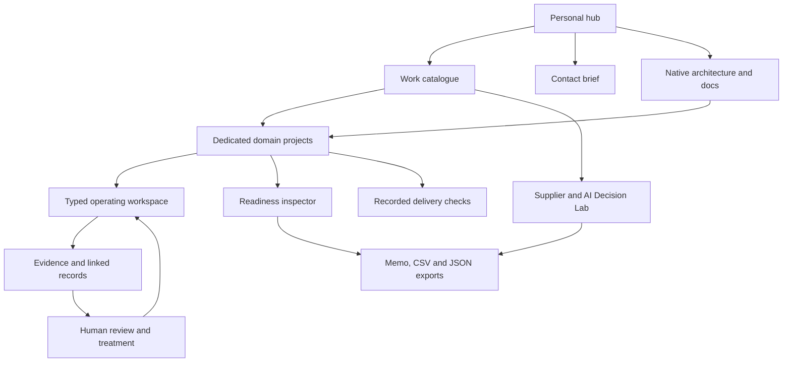
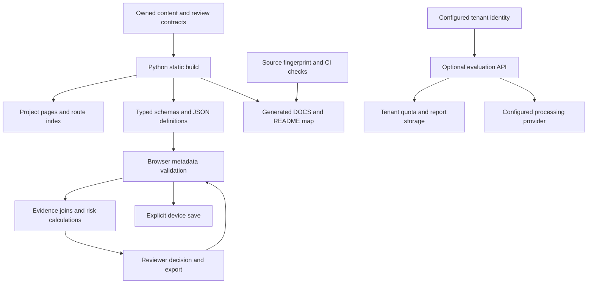
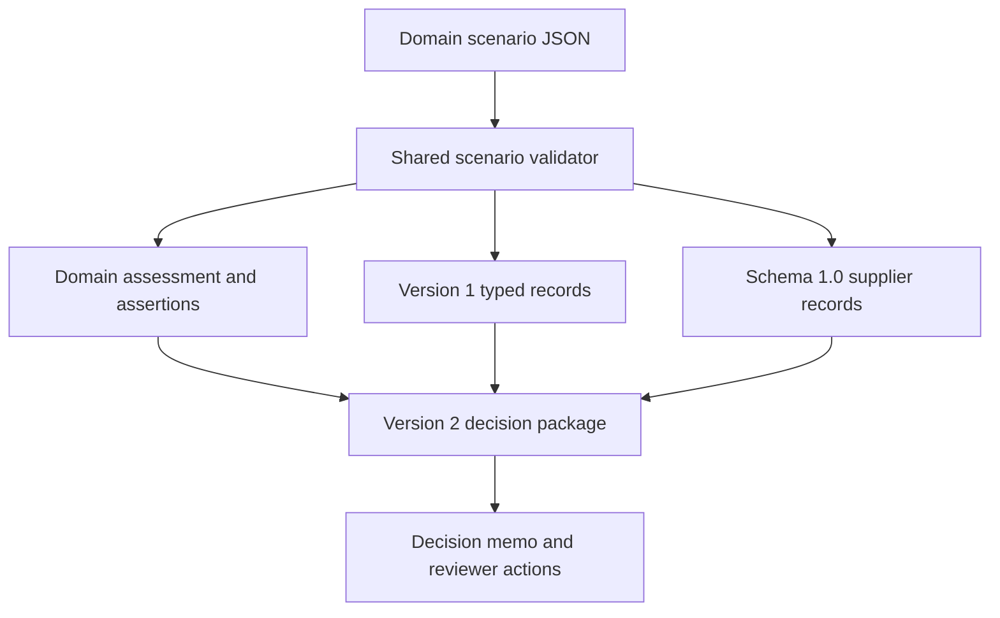

# GRC suite: system guide and client demonstration manual

Generated from 29 active domain projects, 16 record types and 132 register/reporting views.

Source contract SHA-256: `cbd19a94d310c8f433006abd6c8ebacf37333af369d605ed83d946557cd51e27`

## System overview

The portfolio is a static, owned-source website deployed from GitHub to Cloudflare Pages. The personal hub introduces the offer; the catalogue and project pages explain scope; the workspace stores typed governance metadata and recalculates joined views. No browser action silently approves risk, fetches an evidence URL, runs a cloud collector or sends confidential evidence.





## Navigation and route contract

| Route | What it opens | Client purpose |
|---|---|---|
| [/contact/](https://aaowasi.pages.dev/contact/) | Named page, controls and destinations enumerated below | Inspect scope, evidence and next action |
| [/docs/](https://aaowasi.pages.dev/docs/) | Named page, controls and destinations enumerated below | Inspect scope, evidence and next action |
| [//](https://aaowasi.pages.dev//) | Named page, controls and destinations enumerated below | Inspect scope, evidence and next action |
| [/privacy/](https://aaowasi.pages.dev/privacy/) | Named page, controls and destinations enumerated below | Inspect scope, evidence and next action |
| [/profile/](https://aaowasi.pages.dev/profile/) | Named page, controls and destinations enumerated below | Inspect scope, evidence and next action |
| [/services/](https://aaowasi.pages.dev/services/) | Named page, controls and destinations enumerated below | Inspect scope, evidence and next action |
| [/terms/](https://aaowasi.pages.dev/terms/) | Named page, controls and destinations enumerated below | Inspect scope, evidence and next action |
| [/work/](https://aaowasi.pages.dev/work/) | Named page, controls and destinations enumerated below | Inspect scope, evidence and next action |

The personal hub and portfolio alias have separate browser origins. Device storage is origin-specific. Domain pages on the alias use the canonical project workspace for shared workflow destinations. The Decision Lab is a separate specialist supplier/AI model, not another copy of the typed suite. Its module tabs change in-memory projections; its project links open dedicated /work/ pages.

## State, validation and calculations

- Typed suite: `version: 1`, `records`, `updatedAt`; up to 5,000 records and 20 MB. Each record has an entity type, stable ID and optional domainSlug. Unknown fields, duplicate IDs, invalid typed references and vendor dependency cycles are rejected before committing.
- Inspector: one domain checklist per project, owner, boundary, reviewer, HTTPS evidence reference, validity date and domain-specific decision inputs. Readiness = confirmed checks / checklist length. Any missing scope, owner, reviewer, invalid evidence reference, expired evidence or unconfirmed check holds the gate. Even a complete gate only means ready for accountable review.
- Domain inspectors use coverage, declared tolerance, applicable deadline or recovery objective calculations. The separate typed suite high-risk threshold is ≥15. Decision Lab uses its documented separate policy: high ≥16 and moderate ≥9 after signal points and evidence credit. These are prioritization policies, not probabilities or interchangeable score scales.
- Typed control coverage joins scoped controls to all linked tests, including tests assigned to another domain. Only passing tests within the reporting-date validity period count. A passing test requires evidence URL, named reviewer and test date.
- Decision Lab: `schemaVersion: 1.0`; up to 250 records and 10 MB. A linked supplier/AI record carries evidence state, test result, reviewer, disclosure, oversight and processor metadata. Ten specialist views derive supplier, AI, evidence and questionnaire review signals. Import/export cannot silently interchange this model with the typed suite.
- In-memory edits are lost on page reload unless explicitly exported (or saved via the typed suite device-save button). Readiness review JSON is a report, not a suite import. Saving a form is an assertion, not evidence-content verification.

## Optional backend and integrations

Cloudflare Pages Functions expose `/api/status`, `/api/login`, `/api/account`, `/api/evaluate`. With configured tenant identity, D1 and provider settings, the server validates identity and same-origin requests, validates input, atomically reserves tenant quota, enforces idempotency, calls the configured processing provider over HTTPS and stores a bounded report. Failed/unconfigured dependencies return an error or access-request state. Local browser counts never grant backend access. No billing, SSO or remote processing is claimed live without verified deployment configuration. Repository collectors, policies and OSCAL artifacts are integration building blocks and are not continuously running behind the public pages.

## Domain-by-domain operating and client guide

### D01: Corporate governance & accountability

**What and how:** [Corporate governance & accountability](https://aaowasi-projects.pages.dev/work/governance-program/) uses the `decision` typed register and its domain-specific readiness checklist. Inputs produce dated evidence gaps, ownership requests, a domain-specific assessment and an exportable version-2 JSON review.

**Why it exists:** Named owners, decisions and review dates. Unowned or unsupported decisions create follow-up work and uncertain review boundaries.

**Required assertions and evidence questions:**

- Board mandate and delegated authority recorded. Confirm the supporting artifact, owner and review date rather than relying on the checkbox alone.
- Named accountable owners assigned. Confirm the supporting artifact, owner and review date rather than relying on the checkbox alone.
- Decision rationale and review cadence approved. Confirm the supporting artifact, owner and review date rather than relying on the checkbox alone.

**Framework anchors:** ISO/IEC 27001 clauses 4–6 · NIST SP 800-53 PM. Applicability and control-level interpretation remain with the accountable specialist.

**Upstream:** regulatory-obligations, executive-risk, processor-governance, ai-transparency, shadow-ai, resilience, remediation, financial-conduct.
**Downstream:** executive-risk, policy-governance, ai-governance, financial-conduct.

**B2B value:** Makes missing prerequisites and accountable next actions inspectable before release, procurement or assurance review. Agree a baseline for reviewer effort and overdue issues before claiming savings.

**Demo talking point:** “Here is the decision boundary for corporate governance & accountability. I can change the recorded evidence date or remove one domain assertion and show exactly which prerequisite blocks review. The output preserves the responsible owner, evidence request and linked operating domains.”

### D02: Enterprise risk & appetite

**What and how:** [Enterprise risk & appetite](https://aaowasi-projects.pages.dev/work/executive-risk/) uses the `risk` typed register and its domain-specific readiness checklist. Inputs produce dated evidence gaps, ownership requests, a domain-specific assessment and an exportable version-2 JSON review.

**Why it exists:** Likelihood, impact, treatment and acceptance. Unowned or unsupported decisions create follow-up work and uncertain review boundaries.

**Required assertions and evidence questions:**

- Risk appetite and tolerance documented. Confirm the supporting artifact, owner and review date rather than relying on the checkbox alone.
- Inherent and residual assessments recorded. Confirm the supporting artifact, owner and review date rather than relying on the checkbox alone.
- Treatment and escalation owner assigned. Confirm the supporting artifact, owner and review date rather than relying on the checkbox alone.

**Framework anchors:** NIST SP 800-53 RA · ISO/IEC 27001 clause 6. Applicability and control-level interpretation remain with the accountable specialist.

**Upstream:** governance-program, sector-assurance.
**Downstream:** governance-program, control-management.

**B2B value:** Makes missing prerequisites and accountable next actions inspectable before release, procurement or assurance review. Agree a baseline for reviewer effort and overdue issues before claiming savings.

**Demo talking point:** “Here is the decision boundary for enterprise risk & appetite. I can change the recorded evidence date or remove one domain assertion and show exactly which prerequisite blocks review. The output preserves the responsible owner, evidence request and linked operating domains.”

### D03: Regulatory applicability & change

**What and how:** [Regulatory applicability & change](https://aaowasi-projects.pages.dev/work/regulatory-obligations/) uses the `obligation` typed register and its domain-specific readiness checklist. Inputs produce dated evidence gaps, ownership requests, a domain-specific assessment and an exportable version-2 JSON review.

**Why it exists:** Jurisdiction, applicable requirement and effective date. Unowned or unsupported decisions create follow-up work and uncertain review boundaries.

**Required assertions and evidence questions:**

- Jurisdiction and applicability determined. Confirm the supporting artifact, owner and review date rather than relying on the checkbox alone.
- Obligation-to-control mappings reviewed. Confirm the supporting artifact, owner and review date rather than relying on the checkbox alone.
- Regulatory change owner and review date assigned. Confirm the supporting artifact, owner and review date rather than relying on the checkbox alone.

**Framework anchors:** GDPR · EU AI Act · NIST SP 800-53 PL. Applicability and control-level interpretation remain with the accountable specialist.

**Upstream:** sector-assurance, privacy-lifecycle.
**Downstream:** governance-program, policy-governance, control-management, privacy-lifecycle, ai-transparency, sector-assurance.

**B2B value:** Makes missing prerequisites and accountable next actions inspectable before release, procurement or assurance review. Agree a baseline for reviewer effort and overdue issues before claiming savings.

**Demo talking point:** “Here is the decision boundary for regulatory applicability & change. I can change the recorded evidence date or remove one domain assertion and show exactly which prerequisite blocks review. The output preserves the responsible owner, evidence request and linked operating domains.”

### D04: Policy lifecycle

**What and how:** [Policy lifecycle](https://aaowasi-projects.pages.dev/work/policy-governance/) uses the `policy` typed register and its domain-specific readiness checklist. Inputs produce dated evidence gaps, ownership requests, a domain-specific assessment and an exportable version-2 JSON review.

**Why it exists:** Version, ownership and attestation. Unowned or unsupported decisions create follow-up work and uncertain review boundaries.

**Required assertions and evidence questions:**

- Policy scope and approval owner recorded. Confirm the supporting artifact, owner and review date rather than relying on the checkbox alone.
- Version and effective date controlled. Confirm the supporting artifact, owner and review date rather than relying on the checkbox alone.
- Attestations and exceptions reviewed. Confirm the supporting artifact, owner and review date rather than relying on the checkbox alone.

**Framework anchors:** ISO/IEC 27001 clause 7 · NIST SP 800-53 PL. Applicability and control-level interpretation remain with the accountable specialist.

**Upstream:** governance-program, regulatory-obligations.
**Downstream:** control-management, data-governance, shadow-ai, workforce-security.

**B2B value:** Makes missing prerequisites and accountable next actions inspectable before release, procurement or assurance review. Agree a baseline for reviewer effort and overdue issues before claiming savings.

**Demo talking point:** “Here is the decision boundary for policy lifecycle. I can change the recorded evidence date or remove one domain assertion and show exactly which prerequisite blocks review. The output preserves the responsible owner, evidence request and linked operating domains.”

### D05: Control implementation & ownership

**What and how:** [Control implementation & ownership](https://aaowasi-projects.pages.dev/work/control-management/) uses the `control` typed register and its domain-specific readiness checklist. Inputs produce dated evidence gaps, ownership requests, a domain-specific assessment and an exportable version-2 JSON review.

**Why it exists:** Requirement → control → owner. Unowned or unsupported decisions create follow-up work and uncertain review boundaries.

**Required assertions and evidence questions:**

- Implementation and control owner recorded. Confirm the supporting artifact, owner and review date rather than relying on the checkbox alone.
- Operating evidence and test procedure linked. Confirm the supporting artifact, owner and review date rather than relying on the checkbox alone.
- Exceptions and compensating controls reviewed. Confirm the supporting artifact, owner and review date rather than relying on the checkbox alone.

**Framework anchors:** NIST SP 800-53 · ISO/IEC 27001 Annex A · SOC 2 TSC. Applicability and control-level interpretation remain with the accountable specialist.

**Upstream:** regulatory-obligations, executive-risk, policy-governance.
**Downstream:** internal-audit, audit-readiness.

**B2B value:** Makes missing prerequisites and accountable next actions inspectable before release, procurement or assurance review. Agree a baseline for reviewer effort and overdue issues before claiming savings.

**Demo talking point:** “Here is the decision boundary for control implementation & ownership. I can change the recorded evidence date or remove one domain assertion and show exactly which prerequisite blocks review. The output preserves the responsible owner, evidence request and linked operating domains.”

### D06: Internal audit & independence

**What and how:** [Internal audit & independence](https://aaowasi-projects.pages.dev/work/internal-audit/) uses the `audit` typed register and its domain-specific readiness checklist. Inputs produce dated evidence gaps, ownership requests, a domain-specific assessment and an exportable version-2 JSON review.

**Why it exists:** Plan, finding and corrective action. Unowned or unsupported decisions create follow-up work and uncertain review boundaries.

**Required assertions and evidence questions:**

- Audit independence and mandate documented. Confirm the supporting artifact, owner and review date rather than relying on the checkbox alone.
- Risk-based scope and sampling approved. Confirm the supporting artifact, owner and review date rather than relying on the checkbox alone.
- Findings and management actions assigned. Confirm the supporting artifact, owner and review date rather than relying on the checkbox alone.

**Framework anchors:** ISO/IEC 27001 clause 9 · NIST SP 800-53 CA. Applicability and control-level interpretation remain with the accountable specialist.

**Upstream:** control-management, evidence-integrity.
**Downstream:** audit-readiness, financial-conduct.

**B2B value:** Makes missing prerequisites and accountable next actions inspectable before release, procurement or assurance review. Agree a baseline for reviewer effort and overdue issues before claiming savings.

**Demo talking point:** “Here is the decision boundary for internal audit & independence. I can change the recorded evidence date or remove one domain assertion and show exactly which prerequisite blocks review. The output preserves the responsible owner, evidence request and linked operating domains.”

### D07: External audit & certification readiness

**What and how:** [External audit & certification readiness](https://aaowasi-projects.pages.dev/work/audit-readiness/) uses the `test` typed register and its domain-specific readiness checklist. Inputs produce dated evidence gaps, ownership requests, a domain-specific assessment and an exportable version-2 JSON review.

**Why it exists:** Reviewed tests and dated evidence. Unowned or unsupported decisions create follow-up work and uncertain review boundaries.

**Required assertions and evidence questions:**

- Audit scope and reporting period agreed. Confirm the supporting artifact, owner and review date rather than relying on the checkbox alone.
- Control evidence and reviewer recorded. Confirm the supporting artifact, owner and review date rather than relying on the checkbox alone.
- Readiness gaps and retest dates assigned. Confirm the supporting artifact, owner and review date rather than relying on the checkbox alone.

**Framework anchors:** SOC 2 TSC · ISO/IEC 27001 clauses 9–10. Applicability and control-level interpretation remain with the accountable specialist.

**Upstream:** internal-audit, evidence-integrity, control-management.
**Downstream:** customer-assurance, ongoing-authorization.

**B2B value:** Makes missing prerequisites and accountable next actions inspectable before release, procurement or assurance review. Agree a baseline for reviewer effort and overdue issues before claiming savings.

**Demo talking point:** “Here is the decision boundary for external audit & certification readiness. I can change the recorded evidence date or remove one domain assertion and show exactly which prerequisite blocks review. The output preserves the responsible owner, evidence request and linked operating domains.”

### D08: Continuous assurance & remediation

**What and how:** [Continuous assurance & remediation](https://aaowasi-projects.pages.dev/work/continuous-assurance/) uses the `issue` typed register and its domain-specific readiness checklist. Inputs produce dated evidence gaps, ownership requests, a domain-specific assessment and an exportable version-2 JSON review.

**Why it exists:** Evidence expiry, failed tests and treatment. Unowned or unsupported decisions create follow-up work and uncertain review boundaries.

**Required assertions and evidence questions:**

- Monitoring criteria and frequency defined. Confirm the supporting artifact, owner and review date rather than relying on the checkbox alone.
- Failed or expired evidence routed to an owner. Confirm the supporting artifact, owner and review date rather than relying on the checkbox alone.
- Closure evidence and retest decision reviewed. Confirm the supporting artifact, owner and review date rather than relying on the checkbox alone.

**Framework anchors:** NIST SP 800-53 CA-7 · SOC 2 CC4. Applicability and control-level interpretation remain with the accountable specialist.

**Upstream:** ongoing-authorization, evidence-integrity.
**Downstream:** remediation, ongoing-authorization.

**B2B value:** Makes missing prerequisites and accountable next actions inspectable before release, procurement or assurance review. Agree a baseline for reviewer effort and overdue issues before claiming savings.

**Demo talking point:** “Here is the decision boundary for continuous assurance & remediation. I can change the recorded evidence date or remove one domain assertion and show exactly which prerequisite blocks review. The output preserves the responsible owner, evidence request and linked operating domains.”

### D09: Supplier lifecycle & concentration

**What and how:** [Supplier lifecycle & concentration](https://aaowasi-projects.pages.dev/work/vendor-risk/) uses the `vendor` typed register and its domain-specific readiness checklist. Inputs produce dated evidence gaps, ownership requests, a domain-specific assessment and an exportable version-2 JSON review.

**Why it exists:** Tier, dependencies and exit conditions. Unowned or unsupported decisions create follow-up work and uncertain review boundaries.

**Required assertions and evidence questions:**

- Supplier criticality and concentration assessed. Confirm the supporting artifact, owner and review date rather than relying on the checkbox alone.
- Due diligence and contractual evidence reviewed. Confirm the supporting artifact, owner and review date rather than relying on the checkbox alone.
- Exit plan and reassessment triggers documented. Confirm the supporting artifact, owner and review date rather than relying on the checkbox alone.

**Framework anchors:** NIST SP 800-53 SR · ISO/IEC 27001 Annex A. Applicability and control-level interpretation remain with the accountable specialist.

**Upstream:** customer-assurance, privacy-lifecycle.
**Downstream:** customer-assurance, processor-governance, ai-governance, resilience, security-boundary, threat-supply-chain.

**B2B value:** Makes missing prerequisites and accountable next actions inspectable before release, procurement or assurance review. Agree a baseline for reviewer effort and overdue issues before claiming savings.

**Demo talking point:** “Here is the decision boundary for supplier lifecycle & concentration. I can change the recorded evidence date or remove one domain assertion and show exactly which prerequisite blocks review. The output preserves the responsible owner, evidence request and linked operating domains.”

### D10: Procurement & customer assurance

**What and how:** [Procurement & customer assurance](https://aaowasi-projects.pages.dev/work/customer-assurance/) uses the `contract` typed register and its domain-specific readiness checklist. Inputs produce dated evidence gaps, ownership requests, a domain-specific assessment and an exportable version-2 JSON review.

**Why it exists:** Requirements and evidence-backed answers. Unowned or unsupported decisions create follow-up work and uncertain review boundaries.

**Required assertions and evidence questions:**

- Customer requirement and disclosure scope agreed. Confirm the supporting artifact, owner and review date rather than relying on the checkbox alone.
- Each response linked to approved evidence. Confirm the supporting artifact, owner and review date rather than relying on the checkbox alone.
- External response approved by accountable reviewer. Confirm the supporting artifact, owner and review date rather than relying on the checkbox alone.

**Framework anchors:** SOC 2 CC9 · NIST SP 800-53 SR. Applicability and control-level interpretation remain with the accountable specialist.

**Upstream:** vendor-risk, audit-readiness.
**Downstream:** vendor-risk, sector-assurance.

**B2B value:** Makes missing prerequisites and accountable next actions inspectable before release, procurement or assurance review. Agree a baseline for reviewer effort and overdue issues before claiming savings.

**Demo talking point:** “Here is the decision boundary for procurement & customer assurance. I can change the recorded evidence date or remove one domain assertion and show exactly which prerequisite blocks review. The output preserves the responsible owner, evidence request and linked operating domains.”

### D11: Privacy & individual rights

**What and how:** [Privacy & individual rights](https://aaowasi-projects.pages.dev/work/privacy-lifecycle/) uses the `processing` typed register and its domain-specific readiness checklist. Inputs produce dated evidence gaps, ownership requests, a domain-specific assessment and an exportable version-2 JSON review.

**Why it exists:** Purpose, retention and impact review. Unowned or unsupported decisions create follow-up work and uncertain review boundaries.

**Required assertions and evidence questions:**

- Purpose and lawful basis documented. Confirm the supporting artifact, owner and review date rather than relying on the checkbox alone.
- Rights handling and retention process reviewed. Confirm the supporting artifact, owner and review date rather than relying on the checkbox alone.
- DPIA applicability and privacy owner recorded. Confirm the supporting artifact, owner and review date rather than relying on the checkbox alone.

**Framework anchors:** GDPR Articles 5, 12–22, 25, 35. Applicability and control-level interpretation remain with the accountable specialist.

**Upstream:** data-governance, regulatory-obligations.
**Downstream:** regulatory-obligations, vendor-risk, processor-governance.

**B2B value:** Makes missing prerequisites and accountable next actions inspectable before release, procurement or assurance review. Agree a baseline for reviewer effort and overdue issues before claiming savings.

**Demo talking point:** “Here is the decision boundary for privacy & individual rights. I can change the recorded evidence date or remove one domain assertion and show exactly which prerequisite blocks review. The output preserves the responsible owner, evidence request and linked operating domains.”

### D12: Processors & cross-border transfers

**What and how:** [Processors & cross-border transfers](https://aaowasi-projects.pages.dev/work/processor-governance/) uses the `contract` typed register and its domain-specific readiness checklist. Inputs produce dated evidence gaps, ownership requests, a domain-specific assessment and an exportable version-2 JSON review.

**Why it exists:** DPA, subprocessors and transfer mechanism. Unowned or unsupported decisions create follow-up work and uncertain review boundaries.

**Required assertions and evidence questions:**

- Processor agreement and subprocessors reviewed. Confirm the supporting artifact, owner and review date rather than relying on the checkbox alone.
- Transfer mechanism and jurisdiction assessed. Confirm the supporting artifact, owner and review date rather than relying on the checkbox alone.
- Changes and ongoing processor reviews assigned. Confirm the supporting artifact, owner and review date rather than relying on the checkbox alone.

**Framework anchors:** GDPR Articles 28, 30, 44–49. Applicability and control-level interpretation remain with the accountable specialist.

**Upstream:** vendor-risk, privacy-lifecycle.
**Downstream:** governance-program.

**B2B value:** Makes missing prerequisites and accountable next actions inspectable before release, procurement or assurance review. Agree a baseline for reviewer effort and overdue issues before claiming savings.

**Demo talking point:** “Here is the decision boundary for processors & cross-border transfers. I can change the recorded evidence date or remove one domain assertion and show exactly which prerequisite blocks review. The output preserves the responsible owner, evidence request and linked operating domains.”

### D13: Data classification & retention

**What and how:** [Data classification & retention](https://aaowasi-projects.pages.dev/work/data-governance/) uses the `processing` typed register and its domain-specific readiness checklist. Inputs produce dated evidence gaps, ownership requests, a domain-specific assessment and an exportable version-2 JSON review.

**Why it exists:** Data owner, classification and deletion review. Unowned or unsupported decisions create follow-up work and uncertain review boundaries.

**Required assertions and evidence questions:**

- Data classification and inventory recorded. Confirm the supporting artifact, owner and review date rather than relying on the checkbox alone.
- Retention and deletion rules documented. Confirm the supporting artifact, owner and review date rather than relying on the checkbox alone.
- Access and disposal evidence reviewed. Confirm the supporting artifact, owner and review date rather than relying on the checkbox alone.

**Framework anchors:** GDPR Article 5 · NIST SP 800-53 MP, PT. Applicability and control-level interpretation remain with the accountable specialist.

**Upstream:** security-boundary, policy-governance.
**Downstream:** privacy-lifecycle, ai-governance, security-boundary.

**B2B value:** Makes missing prerequisites and accountable next actions inspectable before release, procurement or assurance review. Agree a baseline for reviewer effort and overdue issues before claiming savings.

**Demo talking point:** “Here is the decision boundary for data classification & retention. I can change the recorded evidence date or remove one domain assertion and show exactly which prerequisite blocks review. The output preserves the responsible owner, evidence request and linked operating domains.”

### D14: AI inventory & lifecycle authorization

**What and how:** [AI inventory & lifecycle authorization](https://aaowasi-projects.pages.dev/work/ai-governance/) uses the `ai` typed register and its domain-specific readiness checklist. Inputs produce dated evidence gaps, ownership requests, a domain-specific assessment and an exportable version-2 JSON review.

**Why it exists:** Inventory, evaluation and deployment decision. Unowned or unsupported decisions create follow-up work and uncertain review boundaries.

**Required assertions and evidence questions:**

- AI purpose and system inventory recorded. Confirm the supporting artifact, owner and review date rather than relying on the checkbox alone.
- Impact assessment and deployment boundary reviewed. Confirm the supporting artifact, owner and review date rather than relying on the checkbox alone.
- Release owner and human oversight assigned. Confirm the supporting artifact, owner and review date rather than relying on the checkbox alone.

**Framework anchors:** NIST AI RMF · ISO/IEC 42001. Applicability and control-level interpretation remain with the accountable specialist.

**Upstream:** vendor-risk, data-governance, governance-program.
**Downstream:** ai-safety, ai-transparency, agent-authorization.

**B2B value:** Makes missing prerequisites and accountable next actions inspectable before release, procurement or assurance review. Agree a baseline for reviewer effort and overdue issues before claiming savings.

**Demo talking point:** “Here is the decision boundary for ai inventory & lifecycle authorization. I can change the recorded evidence date or remove one domain assertion and show exactly which prerequisite blocks review. The output preserves the responsible owner, evidence request and linked operating domains.”

### D15: AI fairness, safety & oversight

**What and how:** [AI fairness, safety & oversight](https://aaowasi-projects.pages.dev/work/ai-safety/) uses the `ai` typed register and its domain-specific readiness checklist. Inputs produce dated evidence gaps, ownership requests, a domain-specific assessment and an exportable version-2 JSON review.

**Why it exists:** Evaluation findings and human review gates. Unowned or unsupported decisions create follow-up work and uncertain review boundaries.

**Required assertions and evidence questions:**

- Evaluation methodology and test population recorded. Confirm the supporting artifact, owner and review date rather than relying on the checkbox alone.
- Fairness and safety failures assigned treatments. Confirm the supporting artifact, owner and review date rather than relying on the checkbox alone.
- Human intervention and escalation tested. Confirm the supporting artifact, owner and review date rather than relying on the checkbox alone.

**Framework anchors:** NIST AI RMF MEASURE/MANAGE · ISO/IEC 42001. Applicability and control-level interpretation remain with the accountable specialist.

**Upstream:** ai-governance, threat-supply-chain.
**Downstream:** ongoing-authorization.

**B2B value:** Makes missing prerequisites and accountable next actions inspectable before release, procurement or assurance review. Agree a baseline for reviewer effort and overdue issues before claiming savings.

**Demo talking point:** “Here is the decision boundary for ai fairness, safety & oversight. I can change the recorded evidence date or remove one domain assertion and show exactly which prerequisite blocks review. The output preserves the responsible owner, evidence request and linked operating domains.”

### D16: AI transparency & content provenance

**What and how:** [AI transparency & content provenance](https://aaowasi-projects.pages.dev/work/ai-transparency/) uses the `ai` typed register and its domain-specific readiness checklist. Inputs produce dated evidence gaps, ownership requests, a domain-specific assessment and an exportable version-2 JSON review.

**Why it exists:** Disclosure decision and evidence. Unowned or unsupported decisions create follow-up work and uncertain review boundaries.

**Required assertions and evidence questions:**

- AI transparency applicability determined. Confirm the supporting artifact, owner and review date rather than relying on the checkbox alone.
- Disclosure and content provenance tested. Confirm the supporting artifact, owner and review date rather than relying on the checkbox alone.
- Release approval and evidence retained. Confirm the supporting artifact, owner and review date rather than relying on the checkbox alone.

**Framework anchors:** EU AI Act Article 50. Applicability and control-level interpretation remain with the accountable specialist.

**Upstream:** ai-governance, regulatory-obligations.
**Downstream:** governance-program.

**B2B value:** Makes missing prerequisites and accountable next actions inspectable before release, procurement or assurance review. Agree a baseline for reviewer effort and overdue issues before claiming savings.

**Demo talking point:** “Here is the decision boundary for ai transparency & content provenance. I can change the recorded evidence date or remove one domain assertion and show exactly which prerequisite blocks review. The output preserves the responsible owner, evidence request and linked operating domains.”

### D17: Shadow AI & acceptable use

**What and how:** [Shadow AI & acceptable use](https://aaowasi-projects.pages.dev/work/shadow-ai/) uses the `ai` typed register and its domain-specific readiness checklist. Inputs produce dated evidence gaps, ownership requests, a domain-specific assessment and an exportable version-2 JSON review.

**Why it exists:** Use-case intake and egress review. Unowned or unsupported decisions create follow-up work and uncertain review boundaries.

**Required assertions and evidence questions:**

- Approved tools and acceptable use policy recorded. Confirm the supporting artifact, owner and review date rather than relying on the checkbox alone.
- Data egress and sensitive-use boundaries reviewed. Confirm the supporting artifact, owner and review date rather than relying on the checkbox alone.
- Exceptions and remediation owners assigned. Confirm the supporting artifact, owner and review date rather than relying on the checkbox alone.

**Framework anchors:** NIST AI RMF · ISO/IEC 27001 Annex A. Applicability and control-level interpretation remain with the accountable specialist.

**Upstream:** policy-governance, agent-authorization.
**Downstream:** governance-program.

**B2B value:** Makes missing prerequisites and accountable next actions inspectable before release, procurement or assurance review. Agree a baseline for reviewer effort and overdue issues before claiming savings.

**Demo talking point:** “Here is the decision boundary for shadow ai & acceptable use. I can change the recorded evidence date or remove one domain assertion and show exactly which prerequisite blocks review. The output preserves the responsible owner, evidence request and linked operating domains.”

### D18: Continuity, recovery & crisis readiness

**What and how:** [Continuity, recovery & crisis readiness](https://aaowasi-projects.pages.dev/work/resilience/) uses the `asset` typed register and its domain-specific readiness checklist. Inputs produce dated evidence gaps, ownership requests, a domain-specific assessment and an exportable version-2 JSON review.

**Why it exists:** Critical services, recovery objectives and exercise evidence. Unowned or unsupported decisions create follow-up work and uncertain review boundaries.

**Required assertions and evidence questions:**

- Critical services and recovery objectives recorded. Confirm the supporting artifact, owner and review date rather than relying on the checkbox alone.
- Recovery exercise evidence reviewed. Confirm the supporting artifact, owner and review date rather than relying on the checkbox alone.
- Dependency and crisis escalation owners assigned. Confirm the supporting artifact, owner and review date rather than relying on the checkbox alone.

**Framework anchors:** NIST SP 800-53 CP · ISO/IEC 27001 Annex A. Applicability and control-level interpretation remain with the accountable specialist.

**Upstream:** security-boundary, vendor-risk.
**Downstream:** governance-program.

**B2B value:** Makes missing prerequisites and accountable next actions inspectable before release, procurement or assurance review. Agree a baseline for reviewer effort and overdue issues before claiming savings.

**Demo talking point:** “Here is the decision boundary for continuity, recovery & crisis readiness. I can change the recorded evidence date or remove one domain assertion and show exactly which prerequisite blocks review. The output preserves the responsible owner, evidence request and linked operating domains.”

### D19: Incident governance & reporting

**What and how:** [Incident governance & reporting](https://aaowasi-projects.pages.dev/work/remediation/) uses the `issue` typed register and its domain-specific readiness checklist. Inputs produce dated evidence gaps, ownership requests, a domain-specific assessment and an exportable version-2 JSON review.

**Why it exists:** Incident owner, escalation and corrective action. Unowned or unsupported decisions create follow-up work and uncertain review boundaries.

**Required assertions and evidence questions:**

- Incident classification and escalation documented. Confirm the supporting artifact, owner and review date rather than relying on the checkbox alone.
- Notification applicability and deadlines assessed. Confirm the supporting artifact, owner and review date rather than relying on the checkbox alone.
- Containment and post-incident actions assigned. Confirm the supporting artifact, owner and review date rather than relying on the checkbox alone.

**Framework anchors:** NIST SP 800-53 IR · GDPR Articles 33–34. Applicability and control-level interpretation remain with the accountable specialist.

**Upstream:** threat-supply-chain, continuous-assurance.
**Downstream:** governance-program.

**B2B value:** Makes missing prerequisites and accountable next actions inspectable before release, procurement or assurance review. Agree a baseline for reviewer effort and overdue issues before claiming savings.

**Demo talking point:** “Here is the decision boundary for incident governance & reporting. I can change the recorded evidence date or remove one domain assertion and show exactly which prerequisite blocks review. The output preserves the responsible owner, evidence request and linked operating domains.”

### D20: Workforce, physical & organizational security

**What and how:** [Workforce, physical & organizational security](https://aaowasi-projects.pages.dev/work/workforce-security/) uses the `policy` typed register and its domain-specific readiness checklist. Inputs produce dated evidence gaps, ownership requests, a domain-specific assessment and an exportable version-2 JSON review.

**Why it exists:** Control and review records; specialist assessment required. Unowned or unsupported decisions create follow-up work and uncertain review boundaries.

**Required assertions and evidence questions:**

- Joiner mover leaver responsibilities documented. Confirm the supporting artifact, owner and review date rather than relying on the checkbox alone.
- Security training and access reviews evidenced. Confirm the supporting artifact, owner and review date rather than relying on the checkbox alone.
- Physical access and personnel exceptions reviewed. Confirm the supporting artifact, owner and review date rather than relying on the checkbox alone.

**Framework anchors:** NIST SP 800-53 AT, PS, PE · ISO/IEC 27001 Annex A. Applicability and control-level interpretation remain with the accountable specialist.

**Upstream:** policy-governance, identity-authorization.
**Downstream:** identity-authorization.

**B2B value:** Makes missing prerequisites and accountable next actions inspectable before release, procurement or assurance review. Agree a baseline for reviewer effort and overdue issues before claiming savings.

**Demo talking point:** “Here is the decision boundary for workforce, physical & organizational security. I can change the recorded evidence date or remove one domain assertion and show exactly which prerequisite blocks review. The output preserves the responsible owner, evidence request and linked operating domains.”

### D21: Financial, fraud & ethical conduct risk

**What and how:** [Financial, fraud & ethical conduct risk](https://aaowasi-projects.pages.dev/work/financial-conduct/) uses the `risk` typed register and its domain-specific readiness checklist. Inputs produce dated evidence gaps, ownership requests, a domain-specific assessment and an exportable version-2 JSON review.

**Why it exists:** Exposure and risk decisions; specialist assessment required. Unowned or unsupported decisions create follow-up work and uncertain review boundaries.

**Required assertions and evidence questions:**

- Financial approval limits and segregation defined. Confirm the supporting artifact, owner and review date rather than relying on the checkbox alone.
- Fraud and conflict-of-interest controls reviewed. Confirm the supporting artifact, owner and review date rather than relying on the checkbox alone.
- Escalation and investigation ownership assigned. Confirm the supporting artifact, owner and review date rather than relying on the checkbox alone.

**Framework anchors:** NIST SP 800-53 PM, RA. Applicability and control-level interpretation remain with the accountable specialist.

**Upstream:** governance-program, internal-audit.
**Downstream:** governance-program.

**B2B value:** Makes missing prerequisites and accountable next actions inspectable before release, procurement or assurance review. Agree a baseline for reviewer effort and overdue issues before claiming savings.

**Demo talking point:** “Here is the decision boundary for financial, fraud & ethical conduct risk. I can change the recorded evidence date or remove one domain assertion and show exactly which prerequisite blocks review. The output preserves the responsible owner, evidence request and linked operating domains.”

### D22: Sector, market & contractual obligations

**What and how:** [Sector, market & contractual obligations](https://aaowasi-projects.pages.dev/work/sector-assurance/) uses the `obligation` typed register and its domain-specific readiness checklist. Inputs produce dated evidence gaps, ownership requests, a domain-specific assessment and an exportable version-2 JSON review.

**Why it exists:** Applicability review; sector-specific controls require scoping. Unowned or unsupported decisions create follow-up work and uncertain review boundaries.

**Required assertions and evidence questions:**

- Sector and contractual applicability recorded. Confirm the supporting artifact, owner and review date rather than relying on the checkbox alone.
- Baseline and market-entry requirements mapped. Confirm the supporting artifact, owner and review date rather than relying on the checkbox alone.
- Exceptions and evidence requests assigned. Confirm the supporting artifact, owner and review date rather than relying on the checkbox alone.

**Framework anchors:** FedRAMP Rev5 when in scope. Applicability and control-level interpretation remain with the accountable specialist.

**Upstream:** regulatory-obligations, customer-assurance.
**Downstream:** executive-risk, regulatory-obligations.

**B2B value:** Makes missing prerequisites and accountable next actions inspectable before release, procurement or assurance review. Agree a baseline for reviewer effort and overdue issues before claiming savings.

**Demo talking point:** “Here is the decision boundary for sector, market & contractual obligations. I can change the recorded evidence date or remove one domain assertion and show exactly which prerequisite blocks review. The output preserves the responsible owner, evidence request and linked operating domains.”

### D23: Security scope & authorization boundary

**What and how:** [Security scope & authorization boundary](https://aaowasi-projects.pages.dev/work/security-boundary/) uses the `asset` typed register and its domain-specific readiness checklist. Inputs produce dated evidence gaps, ownership requests, a domain-specific assessment and an exportable version-2 JSON review.

**Why it exists:** Asset scope and system boundary; deployment architecture review. Unowned or unsupported decisions create follow-up work and uncertain review boundaries.

**Required assertions and evidence questions:**

- System assets data flows and interfaces inventoried. Confirm the supporting artifact, owner and review date rather than relying on the checkbox alone.
- Trust boundaries and excluded scope documented. Confirm the supporting artifact, owner and review date rather than relying on the checkbox alone.
- Authorization owner and boundary changes reviewed. Confirm the supporting artifact, owner and review date rather than relying on the checkbox alone.

**Framework anchors:** NIST RMF · NIST SP 800-53 PL-2, CA-3. Applicability and control-level interpretation remain with the accountable specialist.

**Upstream:** vendor-risk, data-governance.
**Downstream:** data-governance, resilience, identity-authorization, cloud-change.

**B2B value:** Makes missing prerequisites and accountable next actions inspectable before release, procurement or assurance review. Agree a baseline for reviewer effort and overdue issues before claiming savings.

**Demo talking point:** “Here is the decision boundary for security scope & authorization boundary. I can change the recorded evidence date or remove one domain assertion and show exactly which prerequisite blocks review. The output preserves the responsible owner, evidence request and linked operating domains.”

### D24: Identity, least privilege & segregation

**What and how:** [Identity, least privilege & segregation](https://aaowasi-projects.pages.dev/work/identity-authorization/) uses the `control` typed register and its domain-specific readiness checklist. Inputs produce dated evidence gaps, ownership requests, a domain-specific assessment and an exportable version-2 JSON review.

**Why it exists:** IAM evidence and authorization policy source. Unowned or unsupported decisions create follow-up work and uncertain review boundaries.

**Required assertions and evidence questions:**

- Identity and privilege inventory recorded. Confirm the supporting artifact, owner and review date rather than relying on the checkbox alone.
- Least privilege and segregation reviewed. Confirm the supporting artifact, owner and review date rather than relying on the checkbox alone.
- Access recertification and revocation evidenced. Confirm the supporting artifact, owner and review date rather than relying on the checkbox alone.

**Framework anchors:** NIST SP 800-53 AC, IA · SOC 2 CC6. Applicability and control-level interpretation remain with the accountable specialist.

**Upstream:** security-boundary, workforce-security.
**Downstream:** workforce-security, cloud-change, evidence-integrity, agent-authorization.

**B2B value:** Makes missing prerequisites and accountable next actions inspectable before release, procurement or assurance review. Agree a baseline for reviewer effort and overdue issues before claiming savings.

**Demo talking point:** “Here is the decision boundary for identity, least privilege & segregation. I can change the recorded evidence date or remove one domain assertion and show exactly which prerequisite blocks review. The output preserves the responsible owner, evidence request and linked operating domains.”

### D25: Cloud configuration & change

**What and how:** [Cloud configuration & change](https://aaowasi-projects.pages.dev/work/cloud-change/) uses the `asset` typed register and its domain-specific readiness checklist. Inputs produce dated evidence gaps, ownership requests, a domain-specific assessment and an exportable version-2 JSON review.

**Why it exists:** Configuration events and control decisions. Unowned or unsupported decisions create follow-up work and uncertain review boundaries.

**Required assertions and evidence questions:**

- Configuration baseline and change owner recorded. Confirm the supporting artifact, owner and review date rather than relying on the checkbox alone.
- Change impact and rollback evidence reviewed. Confirm the supporting artifact, owner and review date rather than relying on the checkbox alone.
- Drift and unauthorized changes routed to review. Confirm the supporting artifact, owner and review date rather than relying on the checkbox alone.

**Framework anchors:** NIST SP 800-53 CM · SOC 2 CC8. Applicability and control-level interpretation remain with the accountable specialist.

**Upstream:** security-boundary, identity-authorization.
**Downstream:** threat-supply-chain, evidence-integrity.

**B2B value:** Makes missing prerequisites and accountable next actions inspectable before release, procurement or assurance review. Agree a baseline for reviewer effort and overdue issues before claiming savings.

**Demo talking point:** “Here is the decision boundary for cloud configuration & change. I can change the recorded evidence date or remove one domain assertion and show exactly which prerequisite blocks review. The output preserves the responsible owner, evidence request and linked operating domains.”

### D26: Threat, vulnerability & supply-chain assurance

**What and how:** [Threat, vulnerability & supply-chain assurance](https://aaowasi-projects.pages.dev/work/threat-supply-chain/) uses the `asset` typed register and its domain-specific readiness checklist. Inputs produce dated evidence gaps, ownership requests, a domain-specific assessment and an exportable version-2 JSON review.

**Why it exists:** Alert normalization and remediation priorities. Unowned or unsupported decisions create follow-up work and uncertain review boundaries.

**Required assertions and evidence questions:**

- Threat and vulnerability inventory recorded. Confirm the supporting artifact, owner and review date rather than relying on the checkbox alone.
- Supplier dependencies and patch priorities assessed. Confirm the supporting artifact, owner and review date rather than relying on the checkbox alone.
- Remediation and retest evidence reviewed. Confirm the supporting artifact, owner and review date rather than relying on the checkbox alone.

**Framework anchors:** NIST SP 800-53 RA-5, SI-2, SR. Applicability and control-level interpretation remain with the accountable specialist.

**Upstream:** vendor-risk, cloud-change.
**Downstream:** ai-safety, remediation.

**B2B value:** Makes missing prerequisites and accountable next actions inspectable before release, procurement or assurance review. Agree a baseline for reviewer effort and overdue issues before claiming savings.

**Demo talking point:** “Here is the decision boundary for threat, vulnerability & supply-chain assurance. I can change the recorded evidence date or remove one domain assertion and show exactly which prerequisite blocks review. The output preserves the responsible owner, evidence request and linked operating domains.”

### D27: Logging, evidence integrity & provenance

**What and how:** [Logging, evidence integrity & provenance](https://aaowasi-projects.pages.dev/work/evidence-integrity/) uses the `test` typed register and its domain-specific readiness checklist. Inputs produce dated evidence gaps, ownership requests, a domain-specific assessment and an exportable version-2 JSON review.

**Why it exists:** Source timestamps and evidence validation. Unowned or unsupported decisions create follow-up work and uncertain review boundaries.

**Required assertions and evidence questions:**

- Log sources timestamps and retention defined. Confirm the supporting artifact, owner and review date rather than relying on the checkbox alone.
- Evidence integrity and provenance verified. Confirm the supporting artifact, owner and review date rather than relying on the checkbox alone.
- Evidence access and custody ownership assigned. Confirm the supporting artifact, owner and review date rather than relying on the checkbox alone.

**Framework anchors:** NIST SP 800-53 AU · SOC 2 CC7. Applicability and control-level interpretation remain with the accountable specialist.

**Upstream:** cloud-change, identity-authorization.
**Downstream:** internal-audit, audit-readiness, continuous-assurance.

**B2B value:** Makes missing prerequisites and accountable next actions inspectable before release, procurement or assurance review. Agree a baseline for reviewer effort and overdue issues before claiming savings.

**Demo talking point:** “Here is the decision boundary for logging, evidence integrity & provenance. I can change the recorded evidence date or remove one domain assertion and show exactly which prerequisite blocks review. The output preserves the responsible owner, evidence request and linked operating domains.”

### D28: Agent, tool & data authorization

**What and how:** [Agent, tool & data authorization](https://aaowasi-projects.pages.dev/work/agent-authorization/) uses the `decision` typed register and its domain-specific readiness checklist. Inputs produce dated evidence gaps, ownership requests, a domain-specific assessment and an exportable version-2 JSON review.

**Why it exists:** Agent/tool authorization policies and human escalation. Unowned or unsupported decisions create follow-up work and uncertain review boundaries.

**Required assertions and evidence questions:**

- Agent identity tools and data permissions scoped. Confirm the supporting artifact, owner and review date rather than relying on the checkbox alone.
- Tool actions and human approval gates defined. Confirm the supporting artifact, owner and review date rather than relying on the checkbox alone.
- Revocation and decision logging tested. Confirm the supporting artifact, owner and review date rather than relying on the checkbox alone.

**Framework anchors:** NIST SP 800-53 AC · NIST AI RMF. Applicability and control-level interpretation remain with the accountable specialist.

**Upstream:** ai-governance, identity-authorization.
**Downstream:** shadow-ai.

**B2B value:** Makes missing prerequisites and accountable next actions inspectable before release, procurement or assurance review. Agree a baseline for reviewer effort and overdue issues before claiming savings.

**Demo talking point:** “Here is the decision boundary for agent, tool & data authorization. I can change the recorded evidence date or remove one domain assertion and show exactly which prerequisite blocks review. The output preserves the responsible owner, evidence request and linked operating domains.”

### D29: Assessment, authorization & ongoing monitoring

**What and how:** [Assessment, authorization & ongoing monitoring](https://aaowasi-projects.pages.dev/work/ongoing-authorization/) uses the `decision` typed register and its domain-specific readiness checklist. Inputs produce dated evidence gaps, ownership requests, a domain-specific assessment and an exportable version-2 JSON review.

**Why it exists:** Review packages; authorization remains with designated authority. Unowned or unsupported decisions create follow-up work and uncertain review boundaries.

**Required assertions and evidence questions:**

- Assessment scope and authorization package recorded. Confirm the supporting artifact, owner and review date rather than relying on the checkbox alone.
- Authority decision and exceptions documented. Confirm the supporting artifact, owner and review date rather than relying on the checkbox alone.
- Monitoring cadence and reauthorization triggers assigned. Confirm the supporting artifact, owner and review date rather than relying on the checkbox alone.

**Framework anchors:** NIST SP 800-53 CA-2, CA-6, CA-7 · FedRAMP Rev5. Applicability and control-level interpretation remain with the accountable specialist.

**Upstream:** audit-readiness, ai-safety, continuous-assurance.
**Downstream:** continuous-assurance.

**B2B value:** Makes missing prerequisites and accountable next actions inspectable before release, procurement or assurance review. Agree a baseline for reviewer effort and overdue issues before claiming savings.

**Demo talking point:** “Here is the decision boundary for assessment, authorization & ongoing monitoring. I can change the recorded evidence date or remove one domain assertion and show exactly which prerequisite blocks review. The output preserves the responsible owner, evidence request and linked operating domains.”

## Every page control and action

This inventory is generated from the shipped HTML. Repeated controls appear once per route. Dynamically rendered controls and form fields are explained after the inventory.

### /404.html

| Element | Operational logic | Business / demo use |
|---|---|---|
| Skip to content | Moves to the matching page section; project details expand on hash navigation. No records are changed. Destination: `#main`. | Show the input, destination or evidence state; describe the next accountable action rather than promising automatic compliance. |
| ABDULLAH AL OWASI | Navigates to the displayed destination. This action does not submit a form or alter a record. Destination: `/`. | Show the input, destination or evidence state; describe the next accountable action rather than promising automatic compliance. |
| Home | Navigates to the displayed destination. This action does not submit a form or alter a record. Destination: `/`. | Show the input, destination or evidence state; describe the next accountable action rather than promising automatic compliance. |
| Work | Opens the named dedicated project with review scope, readiness inputs, evidence needs and dependency links. Destination: `/work/`. | Show the input, destination or evidence state; describe the next accountable action rather than promising automatic compliance. |
| About | Navigates to the displayed destination. This action does not submit a form or alter a record. Destination: `/#about`. | Show the input, destination or evidence state; describe the next accountable action rather than promising automatic compliance. |
| Contact ↗ | Navigates to the displayed destination. This action does not submit a form or alter a record. Destination: `/contact/`. | Show the input, destination or evidence state; describe the next accountable action rather than promising automatic compliance. |
| ← Back to portfolio | Opens the named dedicated project with review scope, readiness inputs, evidence needs and dependency links. Destination: `https://aaowasi.pages.dev/work/`. | Show the input, destination or evidence state; describe the next accountable action rather than promising automatic compliance. |
| Back | Uses browser history where available; falls back to the gallery. | Show the input, destination or evidence state; describe the next accountable action rather than promising automatic compliance. |
| Forward | Uses browser forward history if available. | Show the input, destination or evidence state; describe the next accountable action rather than promising automatic compliance. |
| Return to portfolio → | Navigates to the displayed destination. This action does not submit a form or alter a record. Destination: `/`. | Show the input, destination or evidence state; describe the next accountable action rather than promising automatic compliance. |
| Open live workspace ↗ | Opens the typed operating workspace; query parameters choose a domain. Preserve current in-memory data through export before leaving. Destination: `https://aaowasi-projects.pages.dev/workspace/`. | Show the input, destination or evidence state; describe the next accountable action rather than promising automatic compliance. |
| Send a scope brief ↗ | Navigates to the displayed destination. This action does not submit a form or alter a record. Destination: `/contact/`. | Show the input, destination or evidence state; describe the next accountable action rather than promising automatic compliance. |
| Personal hub ↗ | Navigates to the displayed destination. This action does not submit a form or alter a record. Destination: `https://aaowasi.pages.dev/`. | Show the input, destination or evidence state; describe the next accountable action rather than promising automatic compliance. |
| Project workspace ↗ | Navigates to the displayed destination. This action does not submit a form or alter a record. Destination: `https://aaowasi-projects.pages.dev/`. | Show the input, destination or evidence state; describe the next accountable action rather than promising automatic compliance. |
| GitHub ↗ | Opens owned source or documentation in GitHub for technical inspection. Destination: `https://github.com/aaowasi`. | Show the input, destination or evidence state; describe the next accountable action rather than promising automatic compliance. |
| Operating guide | Navigates to the displayed destination. This action does not submit a form or alter a record. Destination: `/docs/`. | Show the input, destination or evidence state; describe the next accountable action rather than promising automatic compliance. |
| Terms | Navigates to the displayed destination. This action does not submit a form or alter a record. Destination: `/terms/`. | Show the input, destination or evidence state; describe the next accountable action rather than promising automatic compliance. |
| Privacy | Navigates to the displayed destination. This action does not submit a form or alter a record. Destination: `/privacy/`. | Show the input, destination or evidence state; describe the next accountable action rather than promising automatic compliance. |
| Back to top ↑ | Uses browser history where available; falls back to the gallery. Destination: `#main`. | Show the input, destination or evidence state; describe the next accountable action rather than promising automatic compliance. |
### /contact/

| Element | Operational logic | Business / demo use |
|---|---|---|
| Skip to content | Moves to the matching page section; project details expand on hash navigation. No records are changed. Destination: `#main`. | Show the input, destination or evidence state; describe the next accountable action rather than promising automatic compliance. |
| ABDULLAH AL OWASI | Navigates to the displayed destination. This action does not submit a form or alter a record. Destination: `/`. | Show the input, destination or evidence state; describe the next accountable action rather than promising automatic compliance. |
| GRC system | Navigates to the displayed destination. This action does not submit a form or alter a record. Destination: `https://aaowasi-projects.pages.dev/architecture/`. | Show the input, destination or evidence state; describe the next accountable action rather than promising automatic compliance. |
| Work | Opens the named dedicated project with review scope, readiness inputs, evidence needs and dependency links. Destination: `/work/`. | Show the input, destination or evidence state; describe the next accountable action rather than promising automatic compliance. |
| Live dashboard | Navigates to the displayed destination. This action does not submit a form or alter a record. Destination: `https://aaowasi-projects.pages.dev/control-center/`. | Show the input, destination or evidence state; describe the next accountable action rather than promising automatic compliance. |
| Services | Navigates to the displayed destination. This action does not submit a form or alter a record. Destination: `/services/`. | Show the input, destination or evidence state; describe the next accountable action rather than promising automatic compliance. |
| Contact ↗ | Navigates to the displayed destination. This action does not submit a form or alter a record. Destination: `/contact/`. | Show the input, destination or evidence state; describe the next accountable action rather than promising automatic compliance. |
| ← Back to portfolio | Opens the named dedicated project with review scope, readiness inputs, evidence needs and dependency links. Destination: `https://aaowasi.pages.dev/work/`. | Show the input, destination or evidence state; describe the next accountable action rather than promising automatic compliance. |
| Back | Uses browser history where available; falls back to the gallery. | Show the input, destination or evidence state; describe the next accountable action rather than promising automatic compliance. |
| Forward | Uses browser forward history if available. | Show the input, destination or evidence state; describe the next accountable action rather than promising automatic compliance. |
| Run the three guided examples | Navigates to the displayed destination. This action does not submit a form or alter a record. Destination: `https://aaowasi-projects.pages.dev/outcomes/`. | Show the input, destination or evidence state; describe the next accountable action rather than promising automatic compliance. |
| Inspect delivery evidence | Navigates to the displayed destination. This action does not submit a form or alter a record. Destination: `https://aaowasi-projects.pages.dev/results/`. | Show the input, destination or evidence state; describe the next accountable action rather than promising automatic compliance. |
| Review service outputs | Navigates to the displayed destination. This action does not submit a form or alter a record. Destination: `/services/`. | Show the input, destination or evidence state; describe the next accountable action rather than promising automatic compliance. |
| Your name | Accepts the explicitly labeled input; see the associated review or record schema below. Editing is local until the stated save action. | Show the input, destination or evidence state; describe the next accountable action rather than promising automatic compliance. |
| Organization / role | Accepts the explicitly labeled input; see the associated review or record schema below. Editing is local until the stated save action. | Show the input, destination or evidence state; describe the next accountable action rather than promising automatic compliance. |
| Reply email | Accepts the explicitly labeled input; see the associated review or record schema below. Editing is local until the stated save action. | Show the input, destination or evidence state; describe the next accountable action rather than promising automatic compliance. |
| Scope AI use-case decision pack (fixed scope) AI supplier / cross-border transfer pack Audit evidence readiness pack Professional role / interview Organization evaluation access / implementation Other defined engagement | Accepts the explicitly labeled input; see the associated review or record schema below. Editing is local until the stated save action. | Show the input, destination or evidence state; describe the next accountable action rather than promising automatic compliance. |
| Region / jurisdiction Not determined / requires scoping European Union / EEA United Kingdom United States APAC Americas / LATAM MENA / Africa Multi-jurisdiction | Accepts the explicitly labeled input; see the associated review or record schema below. Editing is local until the stated save action. | Show the input, destination or evidence state; describe the next accountable action rather than promising automatic compliance. |
| Timeline Within 2 weeks This month This quarter Exploring / no fixed date | Accepts the explicitly labeled input; see the associated review or record schema below. Editing is local until the stated save action. | Show the input, destination or evidence state; describe the next accountable action rather than promising automatic compliance. |
| Decision brief | Accepts the explicitly labeled input; see the associated review or record schema below. Editing is local until the stated save action. | Show the input, destination or evidence state; describe the next accountable action rather than promising automatic compliance. |
| Prepare decision brief ↗ | Invokes the labeled page action; records remain unchanged unless a validated save, import or clear action completes. | Show the input, destination or evidence state; describe the next accountable action rather than promising automatic compliance. |
| Copy brief | Copies the validated brief to the clipboard, with a recoverable error state if access fails. | Show the input, destination or evidence state; describe the next accountable action rather than promising automatic compliance. |
| abdullahalowasi369@gmail.com | Navigates to the displayed destination. This action does not submit a form or alter a record. Destination: `mailto:abdullahalowasi369@gmail.com`. | Show the input, destination or evidence state; describe the next accountable action rather than promising automatic compliance. |
| Privacy details | Navigates to the displayed destination. This action does not submit a form or alter a record. Destination: `/privacy/`. | Show the input, destination or evidence state; describe the next accountable action rather than promising automatic compliance. |
| Personal hub ↗ | Navigates to the displayed destination. This action does not submit a form or alter a record. Destination: `https://aaowasi.pages.dev/`. | Show the input, destination or evidence state; describe the next accountable action rather than promising automatic compliance. |
| Project workspace ↗ | Navigates to the displayed destination. This action does not submit a form or alter a record. Destination: `https://aaowasi-projects.pages.dev/`. | Show the input, destination or evidence state; describe the next accountable action rather than promising automatic compliance. |
| GitHub ↗ | Opens owned source or documentation in GitHub for technical inspection. Destination: `https://github.com/aaowasi`. | Show the input, destination or evidence state; describe the next accountable action rather than promising automatic compliance. |
| Operating guide | Navigates to the displayed destination. This action does not submit a form or alter a record. Destination: `/docs/`. | Show the input, destination or evidence state; describe the next accountable action rather than promising automatic compliance. |
| Terms | Navigates to the displayed destination. This action does not submit a form or alter a record. Destination: `/terms/`. | Show the input, destination or evidence state; describe the next accountable action rather than promising automatic compliance. |
| Privacy | Navigates to the displayed destination. This action does not submit a form or alter a record. Destination: `/privacy/`. | Show the input, destination or evidence state; describe the next accountable action rather than promising automatic compliance. |
| Back to top ↑ | Uses browser history where available; falls back to the gallery. Destination: `#main`. | Show the input, destination or evidence state; describe the next accountable action rather than promising automatic compliance. |
### /docs/

| Element | Operational logic | Business / demo use |
|---|---|---|
| Skip to content | Moves to the matching page section; project details expand on hash navigation. No records are changed. Destination: `#main`. | Show the input, destination or evidence state; describe the next accountable action rather than promising automatic compliance. |
| ABDULLAH AL OWASI | Navigates to the displayed destination. This action does not submit a form or alter a record. Destination: `/`. | Show the input, destination or evidence state; describe the next accountable action rather than promising automatic compliance. |
| GRC system | Navigates to the displayed destination. This action does not submit a form or alter a record. Destination: `https://aaowasi-projects.pages.dev/architecture/`. | Show the input, destination or evidence state; describe the next accountable action rather than promising automatic compliance. |
| Work | Opens the named dedicated project with review scope, readiness inputs, evidence needs and dependency links. Destination: `/work/`. | Show the input, destination or evidence state; describe the next accountable action rather than promising automatic compliance. |
| Services | Navigates to the displayed destination. This action does not submit a form or alter a record. Destination: `/services/`. | Show the input, destination or evidence state; describe the next accountable action rather than promising automatic compliance. |
| Contact ↗ | Navigates to the displayed destination. This action does not submit a form or alter a record. Destination: `/contact/`. | Show the input, destination or evidence state; describe the next accountable action rather than promising automatic compliance. |
| Read the complete guide and diagrams on GitHub ↗ | Opens owned source or documentation in GitHub for technical inspection. Destination: `https://github.com/aaowasi/aaowasi/blob/main/DOCS.md`. | Show the input, destination or evidence state; describe the next accountable action rather than promising automatic compliance. |
| D01 · Corporate governance & accountability | Expands or collapses this explanation without changing data. Keyboard Enter/Space activates it. | Show the input, destination or evidence state; describe the next accountable action rather than promising automatic compliance. |
| Open project and readiness review → | Opens the named dedicated project with review scope, readiness inputs, evidence needs and dependency links. Destination: `https://aaowasi-projects.pages.dev/work/governance-program/`. | Show the input, destination or evidence state; describe the next accountable action rather than promising automatic compliance. |
| D02 · Enterprise risk & appetite | Expands or collapses this explanation without changing data. Keyboard Enter/Space activates it. | Show the input, destination or evidence state; describe the next accountable action rather than promising automatic compliance. |
| D03 · Regulatory applicability & change | Expands or collapses this explanation without changing data. Keyboard Enter/Space activates it. | Show the input, destination or evidence state; describe the next accountable action rather than promising automatic compliance. |
| D04 · Policy lifecycle | Expands or collapses this explanation without changing data. Keyboard Enter/Space activates it. | Show the input, destination or evidence state; describe the next accountable action rather than promising automatic compliance. |
| D05 · Control implementation & ownership | Expands or collapses this explanation without changing data. Keyboard Enter/Space activates it. | Show the input, destination or evidence state; describe the next accountable action rather than promising automatic compliance. |
| D06 · Internal audit & independence | Expands or collapses this explanation without changing data. Keyboard Enter/Space activates it. | Show the input, destination or evidence state; describe the next accountable action rather than promising automatic compliance. |
| D07 · External audit & certification readiness | Expands or collapses this explanation without changing data. Keyboard Enter/Space activates it. | Show the input, destination or evidence state; describe the next accountable action rather than promising automatic compliance. |
| D08 · Continuous assurance & remediation | Expands or collapses this explanation without changing data. Keyboard Enter/Space activates it. | Show the input, destination or evidence state; describe the next accountable action rather than promising automatic compliance. |
| D09 · Supplier lifecycle & concentration | Expands or collapses this explanation without changing data. Keyboard Enter/Space activates it. | Show the input, destination or evidence state; describe the next accountable action rather than promising automatic compliance. |
| D10 · Procurement & customer assurance | Expands or collapses this explanation without changing data. Keyboard Enter/Space activates it. | Show the input, destination or evidence state; describe the next accountable action rather than promising automatic compliance. |
| D11 · Privacy & individual rights | Expands or collapses this explanation without changing data. Keyboard Enter/Space activates it. | Show the input, destination or evidence state; describe the next accountable action rather than promising automatic compliance. |
| D12 · Processors & cross-border transfers | Expands or collapses this explanation without changing data. Keyboard Enter/Space activates it. | Show the input, destination or evidence state; describe the next accountable action rather than promising automatic compliance. |
| D13 · Data classification & retention | Expands or collapses this explanation without changing data. Keyboard Enter/Space activates it. | Show the input, destination or evidence state; describe the next accountable action rather than promising automatic compliance. |
| D14 · AI inventory & lifecycle authorization | Expands or collapses this explanation without changing data. Keyboard Enter/Space activates it. | Show the input, destination or evidence state; describe the next accountable action rather than promising automatic compliance. |
| D15 · AI fairness, safety & oversight | Expands or collapses this explanation without changing data. Keyboard Enter/Space activates it. | Show the input, destination or evidence state; describe the next accountable action rather than promising automatic compliance. |
| D16 · AI transparency & content provenance | Expands or collapses this explanation without changing data. Keyboard Enter/Space activates it. | Show the input, destination or evidence state; describe the next accountable action rather than promising automatic compliance. |
| D17 · Shadow AI & acceptable use | Expands or collapses this explanation without changing data. Keyboard Enter/Space activates it. | Show the input, destination or evidence state; describe the next accountable action rather than promising automatic compliance. |
| D18 · Continuity, recovery & crisis readiness | Expands or collapses this explanation without changing data. Keyboard Enter/Space activates it. | Show the input, destination or evidence state; describe the next accountable action rather than promising automatic compliance. |
| D19 · Incident governance & reporting | Expands or collapses this explanation without changing data. Keyboard Enter/Space activates it. | Show the input, destination or evidence state; describe the next accountable action rather than promising automatic compliance. |
| D20 · Workforce, physical & organizational security | Expands or collapses this explanation without changing data. Keyboard Enter/Space activates it. | Show the input, destination or evidence state; describe the next accountable action rather than promising automatic compliance. |
| D21 · Financial, fraud & ethical conduct risk | Expands or collapses this explanation without changing data. Keyboard Enter/Space activates it. | Show the input, destination or evidence state; describe the next accountable action rather than promising automatic compliance. |
| D22 · Sector, market & contractual obligations | Expands or collapses this explanation without changing data. Keyboard Enter/Space activates it. | Show the input, destination or evidence state; describe the next accountable action rather than promising automatic compliance. |
| D23 · Security scope & authorization boundary | Expands or collapses this explanation without changing data. Keyboard Enter/Space activates it. | Show the input, destination or evidence state; describe the next accountable action rather than promising automatic compliance. |
| D24 · Identity, least privilege & segregation | Expands or collapses this explanation without changing data. Keyboard Enter/Space activates it. | Show the input, destination or evidence state; describe the next accountable action rather than promising automatic compliance. |
| D25 · Cloud configuration & change | Expands or collapses this explanation without changing data. Keyboard Enter/Space activates it. | Show the input, destination or evidence state; describe the next accountable action rather than promising automatic compliance. |
| D26 · Threat, vulnerability & supply-chain assurance | Expands or collapses this explanation without changing data. Keyboard Enter/Space activates it. | Show the input, destination or evidence state; describe the next accountable action rather than promising automatic compliance. |
| D27 · Logging, evidence integrity & provenance | Expands or collapses this explanation without changing data. Keyboard Enter/Space activates it. | Show the input, destination or evidence state; describe the next accountable action rather than promising automatic compliance. |
| D28 · Agent, tool & data authorization | Expands or collapses this explanation without changing data. Keyboard Enter/Space activates it. | Show the input, destination or evidence state; describe the next accountable action rather than promising automatic compliance. |
| D29 · Assessment, authorization & ongoing monitoring | Expands or collapses this explanation without changing data. Keyboard Enter/Space activates it. | Show the input, destination or evidence state; describe the next accountable action rather than promising automatic compliance. |
| Open operating workspace → | Opens the typed operating workspace; query parameters choose a domain. Preserve current in-memory data through export before leaving. Destination: `https://aaowasi-projects.pages.dev/workspace/`. | Show the input, destination or evidence state; describe the next accountable action rather than promising automatic compliance. |
| Open all domain scenarios → | Navigates to the displayed destination. This action does not submit a form or alter a record. Destination: `https://aaowasi-projects.pages.dev/samples/`. | Show the input, destination or evidence state; describe the next accountable action rather than promising automatic compliance. |
| Personal hub ↗ | Navigates to the displayed destination. This action does not submit a form or alter a record. Destination: `https://aaowasi.pages.dev/`. | Show the input, destination or evidence state; describe the next accountable action rather than promising automatic compliance. |
| Project workspace ↗ | Navigates to the displayed destination. This action does not submit a form or alter a record. Destination: `https://aaowasi-projects.pages.dev/`. | Show the input, destination or evidence state; describe the next accountable action rather than promising automatic compliance. |
| GitHub ↗ | Opens owned source or documentation in GitHub for technical inspection. Destination: `https://github.com/aaowasi`. | Show the input, destination or evidence state; describe the next accountable action rather than promising automatic compliance. |
| Operating guide | Navigates to the displayed destination. This action does not submit a form or alter a record. Destination: `/docs/`. | Show the input, destination or evidence state; describe the next accountable action rather than promising automatic compliance. |
| Terms | Navigates to the displayed destination. This action does not submit a form or alter a record. Destination: `/terms/`. | Show the input, destination or evidence state; describe the next accountable action rather than promising automatic compliance. |
| Privacy | Navigates to the displayed destination. This action does not submit a form or alter a record. Destination: `/privacy/`. | Show the input, destination or evidence state; describe the next accountable action rather than promising automatic compliance. |
| Back to top ↑ | Uses browser history where available; falls back to the gallery. Destination: `#main`. | Show the input, destination or evidence state; describe the next accountable action rather than promising automatic compliance. |
### /

| Element | Operational logic | Business / demo use |
|---|---|---|
| Skip to content | Moves to the matching page section; project details expand on hash navigation. No records are changed. Destination: `#main`. | Show the input, destination or evidence state; describe the next accountable action rather than promising automatic compliance. |
| ABDULLAH AL OWASI | Navigates to the displayed destination. This action does not submit a form or alter a record. Destination: `/`. | Show the input, destination or evidence state; describe the next accountable action rather than promising automatic compliance. |
| GRC system | Navigates to the displayed destination. This action does not submit a form or alter a record. Destination: `https://aaowasi-projects.pages.dev/architecture/`. | Show the input, destination or evidence state; describe the next accountable action rather than promising automatic compliance. |
| Work | Opens the named dedicated project with review scope, readiness inputs, evidence needs and dependency links. Destination: `/work/`. | Show the input, destination or evidence state; describe the next accountable action rather than promising automatic compliance. |
| Services | Navigates to the displayed destination. This action does not submit a form or alter a record. Destination: `/services/`. | Show the input, destination or evidence state; describe the next accountable action rather than promising automatic compliance. |
| Live GRC Dashboard | Navigates to the displayed destination. This action does not submit a form or alter a record. Destination: `https://aaowasi-projects.pages.dev/control-center/`. | Show the input, destination or evidence state; describe the next accountable action rather than promising automatic compliance. |
| Contact ↗ | Navigates to the displayed destination. This action does not submit a form or alter a record. Destination: `/contact/`. | Show the input, destination or evidence state; describe the next accountable action rather than promising automatic compliance. |
| Request a scoped review → | Navigates to the displayed destination. This action does not submit a form or alter a record. Destination: `/contact/`. | Show the input, destination or evidence state; describe the next accountable action rather than promising automatic compliance. |
| Explore live risk dashboard → | Navigates to the displayed destination. This action does not submit a form or alter a record. Destination: `https://aaowasi-projects.pages.dev/control-center/`. | Show the input, destination or evidence state; describe the next accountable action rather than promising automatic compliance. |
| Reproduce this decision → | Navigates to the displayed destination. This action does not submit a form or alter a record. Destination: `https://aaowasi-projects.pages.dev/outcomes/`. | Show the input, destination or evidence state; describe the next accountable action rather than promising automatic compliance. |
| Open Executive GRC Control Center → | Navigates to the displayed destination. This action does not submit a form or alter a record. Destination: `https://aaowasi-projects.pages.dev/control-center/`. | Show the input, destination or evidence state; describe the next accountable action rather than promising automatic compliance. |
| Get example JSON ↓ | Navigates to the displayed destination. This action does not submit a form or alter a record. Destination: `https://aaowasi-projects.pages.dev/samples/ai-governance/1.json`. | Show the input, destination or evidence state; describe the next accountable action rather than promising automatic compliance. |
| Inspect the calculated outputs → | Navigates to the displayed destination. This action does not submit a form or alter a record. Destination: `https://aaowasi-projects.pages.dev/outcomes/`. | Show the input, destination or evidence state; describe the next accountable action rather than promising automatic compliance. |
| AI inventory & lifecycle authorization | Opens the typed operating workspace; query parameters choose a domain. Preserve current in-memory data through export before leaving. Destination: `https://aaowasi-projects.pages.dev/workspace/?domain=ai-governance`. | Show the input, destination or evidence state; describe the next accountable action rather than promising automatic compliance. |
| ↗ | Opens the typed operating workspace; query parameters choose a domain. Preserve current in-memory data through export before leaving. Destination: `https://aaowasi-projects.pages.dev/workspace/?domain=ai-governance`. | Show the input, destination or evidence state; describe the next accountable action rather than promising automatic compliance. |
| Supplier lifecycle & concentration | Opens the typed operating workspace; query parameters choose a domain. Preserve current in-memory data through export before leaving. Destination: `https://aaowasi-projects.pages.dev/workspace/?domain=vendor-risk`. | Show the input, destination or evidence state; describe the next accountable action rather than promising automatic compliance. |
| External audit & certification readiness | Opens the typed operating workspace; query parameters choose a domain. Preserve current in-memory data through export before leaving. Destination: `https://aaowasi-projects.pages.dev/workspace/?domain=audit-readiness`. | Show the input, destination or evidence state; describe the next accountable action rather than promising automatic compliance. |
| Explore connected work → | Opens the named dedicated project with review scope, readiness inputs, evidence needs and dependency links. Destination: `/work/`. | Show the input, destination or evidence state; describe the next accountable action rather than promising automatic compliance. |
| Recorded delivery checks → | Navigates to the displayed destination. This action does not submit a form or alter a record. Destination: `https://aaowasi-projects.pages.dev/results/`. | Show the input, destination or evidence state; describe the next accountable action rather than promising automatic compliance. |
| Review services and handover → | Navigates to the displayed destination. This action does not submit a form or alter a record. Destination: `/services/`. | Show the input, destination or evidence state; describe the next accountable action rather than promising automatic compliance. |
| Professional profile → | Navigates to the displayed destination. This action does not submit a form or alter a record. Destination: `/profile/`. | Show the input, destination or evidence state; describe the next accountable action rather than promising automatic compliance. |
| Explore three guided client scenarios → | Navigates to the displayed destination. This action does not submit a form or alter a record. Destination: `https://aaowasi-projects.pages.dev/outcomes/`. | Show the input, destination or evidence state; describe the next accountable action rather than promising automatic compliance. |
| Personal hub ↗ | Navigates to the displayed destination. This action does not submit a form or alter a record. Destination: `https://aaowasi.pages.dev/`. | Show the input, destination or evidence state; describe the next accountable action rather than promising automatic compliance. |
| Project workspace ↗ | Navigates to the displayed destination. This action does not submit a form or alter a record. Destination: `https://aaowasi-projects.pages.dev/`. | Show the input, destination or evidence state; describe the next accountable action rather than promising automatic compliance. |
| GitHub ↗ | Opens owned source or documentation in GitHub for technical inspection. Destination: `https://github.com/aaowasi`. | Show the input, destination or evidence state; describe the next accountable action rather than promising automatic compliance. |
| Operating guide | Navigates to the displayed destination. This action does not submit a form or alter a record. Destination: `/docs/`. | Show the input, destination or evidence state; describe the next accountable action rather than promising automatic compliance. |
| Terms | Navigates to the displayed destination. This action does not submit a form or alter a record. Destination: `/terms/`. | Show the input, destination or evidence state; describe the next accountable action rather than promising automatic compliance. |
| Privacy | Navigates to the displayed destination. This action does not submit a form or alter a record. Destination: `/privacy/`. | Show the input, destination or evidence state; describe the next accountable action rather than promising automatic compliance. |
| Back to top ↑ | Uses browser history where available; falls back to the gallery. Destination: `#main`. | Show the input, destination or evidence state; describe the next accountable action rather than promising automatic compliance. |
### /privacy/

| Element | Operational logic | Business / demo use |
|---|---|---|
| Skip to content | Moves to the matching page section; project details expand on hash navigation. No records are changed. Destination: `#main`. | Show the input, destination or evidence state; describe the next accountable action rather than promising automatic compliance. |
| ABDULLAH AL OWASI | Navigates to the displayed destination. This action does not submit a form or alter a record. Destination: `/`. | Show the input, destination or evidence state; describe the next accountable action rather than promising automatic compliance. |
| Home | Navigates to the displayed destination. This action does not submit a form or alter a record. Destination: `/`. | Show the input, destination or evidence state; describe the next accountable action rather than promising automatic compliance. |
| Work | Opens the named dedicated project with review scope, readiness inputs, evidence needs and dependency links. Destination: `/work/`. | Show the input, destination or evidence state; describe the next accountable action rather than promising automatic compliance. |
| About | Navigates to the displayed destination. This action does not submit a form or alter a record. Destination: `/#about`. | Show the input, destination or evidence state; describe the next accountable action rather than promising automatic compliance. |
| Contact ↗ | Navigates to the displayed destination. This action does not submit a form or alter a record. Destination: `/#contact`. | Show the input, destination or evidence state; describe the next accountable action rather than promising automatic compliance. |
| ← Back to portfolio | Opens the named dedicated project with review scope, readiness inputs, evidence needs and dependency links. Destination: `https://aaowasi.pages.dev/work/`. | Show the input, destination or evidence state; describe the next accountable action rather than promising automatic compliance. |
| Back | Uses browser history where available; falls back to the gallery. | Show the input, destination or evidence state; describe the next accountable action rather than promising automatic compliance. |
| Forward | Uses browser forward history if available. | Show the input, destination or evidence state; describe the next accountable action rather than promising automatic compliance. |
| Personal hub ↗ | Navigates to the displayed destination. This action does not submit a form or alter a record. Destination: `https://aaowasi.pages.dev/`. | Show the input, destination or evidence state; describe the next accountable action rather than promising automatic compliance. |
| Project workspace ↗ | Navigates to the displayed destination. This action does not submit a form or alter a record. Destination: `https://aaowasi-projects.pages.dev/`. | Show the input, destination or evidence state; describe the next accountable action rather than promising automatic compliance. |
| GitHub ↗ | Opens owned source or documentation in GitHub for technical inspection. Destination: `https://github.com/aaowasi`. | Show the input, destination or evidence state; describe the next accountable action rather than promising automatic compliance. |
| Operating guide | Navigates to the displayed destination. This action does not submit a form or alter a record. Destination: `/docs/`. | Show the input, destination or evidence state; describe the next accountable action rather than promising automatic compliance. |
| Terms | Navigates to the displayed destination. This action does not submit a form or alter a record. Destination: `/terms/`. | Show the input, destination or evidence state; describe the next accountable action rather than promising automatic compliance. |
| Privacy | Navigates to the displayed destination. This action does not submit a form or alter a record. Destination: `/privacy/`. | Show the input, destination or evidence state; describe the next accountable action rather than promising automatic compliance. |
| Back to top ↑ | Uses browser history where available; falls back to the gallery. Destination: `#main`. | Show the input, destination or evidence state; describe the next accountable action rather than promising automatic compliance. |
### /profile/

| Element | Operational logic | Business / demo use |
|---|---|---|
| Skip to content | Moves to the matching page section; project details expand on hash navigation. No records are changed. Destination: `#main`. | Show the input, destination or evidence state; describe the next accountable action rather than promising automatic compliance. |
| ABDULLAH AL OWASI | Navigates to the displayed destination. This action does not submit a form or alter a record. Destination: `/`. | Show the input, destination or evidence state; describe the next accountable action rather than promising automatic compliance. |
| GRC system | Navigates to the displayed destination. This action does not submit a form or alter a record. Destination: `https://aaowasi-projects.pages.dev/architecture/`. | Show the input, destination or evidence state; describe the next accountable action rather than promising automatic compliance. |
| Work | Opens the named dedicated project with review scope, readiness inputs, evidence needs and dependency links. Destination: `/work/`. | Show the input, destination or evidence state; describe the next accountable action rather than promising automatic compliance. |
| GRC Dashboard | Navigates to the displayed destination. This action does not submit a form or alter a record. Destination: `https://aaowasi-projects.pages.dev/control-center/`. | Show the input, destination or evidence state; describe the next accountable action rather than promising automatic compliance. |
| Services | Navigates to the displayed destination. This action does not submit a form or alter a record. Destination: `/services/`. | Show the input, destination or evidence state; describe the next accountable action rather than promising automatic compliance. |
| Contact ↗ | Navigates to the displayed destination. This action does not submit a form or alter a record. Destination: `/contact/`. | Show the input, destination or evidence state; describe the next accountable action rather than promising automatic compliance. |
| ← Back to portfolio | Opens the named dedicated project with review scope, readiness inputs, evidence needs and dependency links. Destination: `https://aaowasi.pages.dev/work/`. | Show the input, destination or evidence state; describe the next accountable action rather than promising automatic compliance. |
| Back | Uses browser history where available; falls back to the gallery. | Show the input, destination or evidence state; describe the next accountable action rather than promising automatic compliance. |
| Forward | Uses browser forward history if available. | Show the input, destination or evidence state; describe the next accountable action rather than promising automatic compliance. |
| Discuss a role or engagement ↗ | Navigates to the displayed destination. This action does not submit a form or alter a record. Destination: `/contact/`. | Show the input, destination or evidence state; describe the next accountable action rather than promising automatic compliance. |
| Print / save as PDF ↓ | Invokes the labeled page action; records remain unchanged unless a validated save, import or clear action completes. | Show the input, destination or evidence state; describe the next accountable action rather than promising automatic compliance. |
| Download resume (Markdown) ↓ | Navigates to the displayed destination. This action does not submit a form or alter a record. Destination: `/assets/Abdullah-Al-Owasi-Resume.md`. | Show the input, destination or evidence state; describe the next accountable action rather than promising automatic compliance. |
| Recorded checks ↗ | Navigates to the displayed destination. This action does not submit a form or alter a record. Destination: `https://aaowasi-projects.pages.dev/results/`. | Show the input, destination or evidence state; describe the next accountable action rather than promising automatic compliance. |
| Live workspace ↗ | Navigates to the displayed destination. This action does not submit a form or alter a record. Destination: `https://aaowasi-projects.pages.dev/control-center/`. | Show the input, destination or evidence state; describe the next accountable action rather than promising automatic compliance. |
| GitHub ↗ | Opens owned source or documentation in GitHub for technical inspection. Destination: `https://github.com/aaowasi`. | Show the input, destination or evidence state; describe the next accountable action rather than promising automatic compliance. |
| Personal hub ↗ | Navigates to the displayed destination. This action does not submit a form or alter a record. Destination: `https://aaowasi.pages.dev/`. | Show the input, destination or evidence state; describe the next accountable action rather than promising automatic compliance. |
| Project workspace ↗ | Navigates to the displayed destination. This action does not submit a form or alter a record. Destination: `https://aaowasi-projects.pages.dev/`. | Show the input, destination or evidence state; describe the next accountable action rather than promising automatic compliance. |
| Operating guide | Navigates to the displayed destination. This action does not submit a form or alter a record. Destination: `/docs/`. | Show the input, destination or evidence state; describe the next accountable action rather than promising automatic compliance. |
| Terms | Navigates to the displayed destination. This action does not submit a form or alter a record. Destination: `/terms/`. | Show the input, destination or evidence state; describe the next accountable action rather than promising automatic compliance. |
| Privacy | Navigates to the displayed destination. This action does not submit a form or alter a record. Destination: `/privacy/`. | Show the input, destination or evidence state; describe the next accountable action rather than promising automatic compliance. |
| Back to top ↑ | Uses browser history where available; falls back to the gallery. Destination: `#main`. | Show the input, destination or evidence state; describe the next accountable action rather than promising automatic compliance. |
### /services/

| Element | Operational logic | Business / demo use |
|---|---|---|
| Skip to content | Moves to the matching page section; project details expand on hash navigation. No records are changed. Destination: `#main`. | Show the input, destination or evidence state; describe the next accountable action rather than promising automatic compliance. |
| ABDULLAH AL OWASI | Navigates to the displayed destination. This action does not submit a form or alter a record. Destination: `/`. | Show the input, destination or evidence state; describe the next accountable action rather than promising automatic compliance. |
| GRC system | Navigates to the displayed destination. This action does not submit a form or alter a record. Destination: `https://aaowasi-projects.pages.dev/architecture/`. | Show the input, destination or evidence state; describe the next accountable action rather than promising automatic compliance. |
| Work | Opens the named dedicated project with review scope, readiness inputs, evidence needs and dependency links. Destination: `/work/`. | Show the input, destination or evidence state; describe the next accountable action rather than promising automatic compliance. |
| Live dashboard | Navigates to the displayed destination. This action does not submit a form or alter a record. Destination: `https://aaowasi-projects.pages.dev/control-center/`. | Show the input, destination or evidence state; describe the next accountable action rather than promising automatic compliance. |
| Services | Navigates to the displayed destination. This action does not submit a form or alter a record. Destination: `/services/`. | Show the input, destination or evidence state; describe the next accountable action rather than promising automatic compliance. |
| Contact ↗ | Navigates to the displayed destination. This action does not submit a form or alter a record. Destination: `/contact/`. | Show the input, destination or evidence state; describe the next accountable action rather than promising automatic compliance. |
| Request fixed-scope quotation ↗ | Navigates to the displayed destination. This action does not submit a form or alter a record. Destination: `/contact/`. | Show the input, destination or evidence state; describe the next accountable action rather than promising automatic compliance. |
| Open interactive executive risk dashboard → | Navigates to the displayed destination. This action does not submit a form or alter a record. Destination: `https://aaowasi-projects.pages.dev/control-center/`. | Show the input, destination or evidence state; describe the next accountable action rather than promising automatic compliance. |
| Inspect three executable sample outputs → Open interactive executive risk dashboard → | Navigates to the displayed destination. This action does not submit a form or alter a record. Destination: `https://aaowasi-projects.pages.dev/outcomes/`. | Show the input, destination or evidence state; describe the next accountable action rather than promising automatic compliance. |
| Engagement questions → | Moves to the matching page section; project details expand on hash navigation. No records are changed. Destination: `#questions`. | Show the input, destination or evidence state; describe the next accountable action rather than promising automatic compliance. |
| Inspect the community and enterprise boundary → | Navigates to the displayed destination. This action does not submit a form or alter a record. Destination: `https://aaowasi-projects.pages.dev/enterprise/`. | Show the input, destination or evidence state; describe the next accountable action rather than promising automatic compliance. |
| What will I receive? | Expands or collapses this explanation without changing data. Keyboard Enter/Space activates it. | Show the input, destination or evidence state; describe the next accountable action rather than promising automatic compliance. |
| How are scope and price agreed? | Expands or collapses this explanation without changing data. Keyboard Enter/Space activates it. | Show the input, destination or evidence state; describe the next accountable action rather than promising automatic compliance. |
| Can my team maintain the outputs? | Expands or collapses this explanation without changing data. Keyboard Enter/Space activates it. | Show the input, destination or evidence state; describe the next accountable action rather than promising automatic compliance. |
| Can I evaluate this for a remote role? | Expands or collapses this explanation without changing data. Keyboard Enter/Space activates it. | Show the input, destination or evidence state; describe the next accountable action rather than promising automatic compliance. |
| Personal hub ↗ | Navigates to the displayed destination. This action does not submit a form or alter a record. Destination: `https://aaowasi.pages.dev/`. | Show the input, destination or evidence state; describe the next accountable action rather than promising automatic compliance. |
| Project workspace ↗ | Navigates to the displayed destination. This action does not submit a form or alter a record. Destination: `https://aaowasi-projects.pages.dev/`. | Show the input, destination or evidence state; describe the next accountable action rather than promising automatic compliance. |
| GitHub ↗ | Opens owned source or documentation in GitHub for technical inspection. Destination: `https://github.com/aaowasi`. | Show the input, destination or evidence state; describe the next accountable action rather than promising automatic compliance. |
| Operating guide | Navigates to the displayed destination. This action does not submit a form or alter a record. Destination: `/docs/`. | Show the input, destination or evidence state; describe the next accountable action rather than promising automatic compliance. |
| Terms | Navigates to the displayed destination. This action does not submit a form or alter a record. Destination: `/terms/`. | Show the input, destination or evidence state; describe the next accountable action rather than promising automatic compliance. |
| Privacy | Navigates to the displayed destination. This action does not submit a form or alter a record. Destination: `/privacy/`. | Show the input, destination or evidence state; describe the next accountable action rather than promising automatic compliance. |
| Back to top ↑ | Uses browser history where available; falls back to the gallery. Destination: `#main`. | Show the input, destination or evidence state; describe the next accountable action rather than promising automatic compliance. |
### /terms/

| Element | Operational logic | Business / demo use |
|---|---|---|
| Skip to content | Moves to the matching page section; project details expand on hash navigation. No records are changed. Destination: `#main`. | Show the input, destination or evidence state; describe the next accountable action rather than promising automatic compliance. |
| ABDULLAH AL OWASI | Navigates to the displayed destination. This action does not submit a form or alter a record. Destination: `/`. | Show the input, destination or evidence state; describe the next accountable action rather than promising automatic compliance. |
| GRC system | Navigates to the displayed destination. This action does not submit a form or alter a record. Destination: `https://aaowasi-projects.pages.dev/architecture/`. | Show the input, destination or evidence state; describe the next accountable action rather than promising automatic compliance. |
| Work | Opens the named dedicated project with review scope, readiness inputs, evidence needs and dependency links. Destination: `/work/`. | Show the input, destination or evidence state; describe the next accountable action rather than promising automatic compliance. |
| Services | Navigates to the displayed destination. This action does not submit a form or alter a record. Destination: `/services/`. | Show the input, destination or evidence state; describe the next accountable action rather than promising automatic compliance. |
| Contact ↗ | Navigates to the displayed destination. This action does not submit a form or alter a record. Destination: `/contact/`. | Show the input, destination or evidence state; describe the next accountable action rather than promising automatic compliance. |
| Personal hub ↗ | Navigates to the displayed destination. This action does not submit a form or alter a record. Destination: `https://aaowasi.pages.dev/`. | Show the input, destination or evidence state; describe the next accountable action rather than promising automatic compliance. |
| Project workspace ↗ | Navigates to the displayed destination. This action does not submit a form or alter a record. Destination: `https://aaowasi-projects.pages.dev/`. | Show the input, destination or evidence state; describe the next accountable action rather than promising automatic compliance. |
| GitHub ↗ | Opens owned source or documentation in GitHub for technical inspection. Destination: `https://github.com/aaowasi`. | Show the input, destination or evidence state; describe the next accountable action rather than promising automatic compliance. |
| Operating guide | Navigates to the displayed destination. This action does not submit a form or alter a record. Destination: `/docs/`. | Show the input, destination or evidence state; describe the next accountable action rather than promising automatic compliance. |
| Terms | Navigates to the displayed destination. This action does not submit a form or alter a record. Destination: `/terms/`. | Show the input, destination or evidence state; describe the next accountable action rather than promising automatic compliance. |
| Privacy | Navigates to the displayed destination. This action does not submit a form or alter a record. Destination: `/privacy/`. | Show the input, destination or evidence state; describe the next accountable action rather than promising automatic compliance. |
| Back to top ↑ | Uses browser history where available; falls back to the gallery. Destination: `#main`. | Show the input, destination or evidence state; describe the next accountable action rather than promising automatic compliance. |
### /work/

| Element | Operational logic | Business / demo use |
|---|---|---|
| Skip to content | Moves to the matching page section; project details expand on hash navigation. No records are changed. Destination: `#main`. | Show the input, destination or evidence state; describe the next accountable action rather than promising automatic compliance. |
| ABDULLAH AL OWASI | Navigates to the displayed destination. This action does not submit a form or alter a record. Destination: `/`. | Show the input, destination or evidence state; describe the next accountable action rather than promising automatic compliance. |
| GRC system | Navigates to the displayed destination. This action does not submit a form or alter a record. Destination: `https://aaowasi-projects.pages.dev/architecture/`. | Show the input, destination or evidence state; describe the next accountable action rather than promising automatic compliance. |
| Work | Opens the named dedicated project with review scope, readiness inputs, evidence needs and dependency links. Destination: `/work/`. | Show the input, destination or evidence state; describe the next accountable action rather than promising automatic compliance. |
| Services | Navigates to the displayed destination. This action does not submit a form or alter a record. Destination: `/services/`. | Show the input, destination or evidence state; describe the next accountable action rather than promising automatic compliance. |
| Contact ↗ | Navigates to the displayed destination. This action does not submit a form or alter a record. Destination: `/contact/`. | Show the input, destination or evidence state; describe the next accountable action rather than promising automatic compliance. |
| ← Back to portfolio | Opens the named dedicated project with review scope, readiness inputs, evidence needs and dependency links. Destination: `https://aaowasi.pages.dev/work/`. | Show the input, destination or evidence state; describe the next accountable action rather than promising automatic compliance. |
| Back | Uses browser history where available; falls back to the gallery. | Show the input, destination or evidence state; describe the next accountable action rather than promising automatic compliance. |
| Forward | Uses browser forward history if available. | Show the input, destination or evidence state; describe the next accountable action rather than promising automatic compliance. |
| Open live workspace ↗ | Opens the typed operating workspace; query parameters choose a domain. Preserve current in-memory data through export before leaving. Destination: `https://aaowasi-projects.pages.dev/workspace/`. | Show the input, destination or evidence state; describe the next accountable action rather than promising automatic compliance. |
| Inspect delivery evidence ↗ | Navigates to the displayed destination. This action does not submit a form or alter a record. Destination: `https://aaowasi-projects.pages.dev/results/`. | Show the input, destination or evidence state; describe the next accountable action rather than promising automatic compliance. |
| AI governance Inventory, oversight & monitoring. AI use-case governance, evaluation evidence, Article 50 transparency, human review and post-deployment change monitoring. Filter AI work → | Navigates to the displayed destination. This action does not submit a form or alter a record. Destination: `?domain=AI%20governance`. | Show the input, destination or evidence state; describe the next accountable action rather than promising automatic compliance. |
| Third-party AI risk Vendors, LLMs & dependencies. Vendor intake, data use, subprocessors, assurance evidence, concentration and accountable treatment decisions. Filter vendor work → | Navigates to the displayed destination. This action does not submit a form or alter a record. Destination: `?domain=Third-party%20risk`. | Show the input, destination or evidence state; describe the next accountable action rather than promising automatic compliance. |
| Audit & assurance Evidence, exceptions & retest. Control evidence, freshness, test states, remediation ownership, questionnaires and customer assurance. Filter assurance work → | Navigates to the displayed destination. This action does not submit a form or alter a record. Destination: `?domain=Assurance`. | Show the input, destination or evidence state; describe the next accountable action rather than promising automatic compliance. |
| Open connected workspace ↗ | Opens the typed operating workspace; query parameters choose a domain. Preserve current in-memory data through export before leaving. Destination: `https://aaowasi-projects.pages.dev/workspace/`. | Show the input, destination or evidence state; describe the next accountable action rather than promising automatic compliance. |
| Search work | Filters the full project catalogue by readable content. | Show the input, destination or evidence state; describe the next accountable action rather than promising automatic compliance. |
| Domain All domains AI fairness, safety & oversight AI inventory & lifecycle authorization AI transparency & content provenance Agent, tool & data authorization Assessment, authorization & ongoing monitoring Cloud configuration & change Continuity, recovery & crisis readiness Continuous assurance & remediation Control implementation & ownership Corporate governance & accountability Data classification & retention Enterprise risk & appetite External audit & certification readiness Financial, fraud & ethical conduct risk Identity, least privilege & segregation Incident governance & reporting Internal audit & independence Logging, evidence integrity & provenance Policy lifecycle Privacy & individual rights Processors & cross-border transfers Procurement & customer assurance Regulatory applicability & change Sector, market & contractual obligations Security scope & authorization boundary Shadow AI & acceptable use Supplier lifecycle & concentration Threat, vulnerability & supply-chain assurance Workforce, physical & organizational security | Filters catalogue cards by the exact selected domain; All domains includes every project. | Show the input, destination or evidence state; describe the next accountable action rather than promising automatic compliance. |
| Format All formats Connected governance workflow | Filters catalogue cards by the available project type. | Show the input, destination or evidence state; describe the next accountable action rather than promising automatic compliance. |
| Corporate governance & accountability | Opens the typed operating workspace; query parameters choose a domain. Preserve current in-memory data through export before leaving. Destination: `https://aaowasi-projects.pages.dev/workspace/?domain=governance-program`. | Show the input, destination or evidence state; describe the next accountable action rather than promising automatic compliance. |
| Explore work ↗ | Opens the typed operating workspace; query parameters choose a domain. Preserve current in-memory data through export before leaving. Destination: `https://aaowasi-projects.pages.dev/workspace/?domain=governance-program`. | Show the input, destination or evidence state; describe the next accountable action rather than promising automatic compliance. |
| View source ↗ | Selects a register/reporting projection over the shared typed records. Changes the URL hash, not the underlying data. Destination: `https://github.com/aaowasi/aaowasi-projects/blob/main/projects/domain-01-governance-program/manifest.json`. | Show the input, destination or evidence state; describe the next accountable action rather than promising automatic compliance. |
| Enterprise risk & appetite | Opens the typed operating workspace; query parameters choose a domain. Preserve current in-memory data through export before leaving. Destination: `https://aaowasi-projects.pages.dev/workspace/?domain=executive-risk`. | Show the input, destination or evidence state; describe the next accountable action rather than promising automatic compliance. |
| Regulatory applicability & change | Opens the typed operating workspace; query parameters choose a domain. Preserve current in-memory data through export before leaving. Destination: `https://aaowasi-projects.pages.dev/workspace/?domain=regulatory-obligations`. | Show the input, destination or evidence state; describe the next accountable action rather than promising automatic compliance. |
| Policy lifecycle | Opens the typed operating workspace; query parameters choose a domain. Preserve current in-memory data through export before leaving. Destination: `https://aaowasi-projects.pages.dev/workspace/?domain=policy-governance`. | Show the input, destination or evidence state; describe the next accountable action rather than promising automatic compliance. |
| Control implementation & ownership | Opens the typed operating workspace; query parameters choose a domain. Preserve current in-memory data through export before leaving. Destination: `https://aaowasi-projects.pages.dev/workspace/?domain=control-management`. | Show the input, destination or evidence state; describe the next accountable action rather than promising automatic compliance. |
| Internal audit & independence | Opens the typed operating workspace; query parameters choose a domain. Preserve current in-memory data through export before leaving. Destination: `https://aaowasi-projects.pages.dev/workspace/?domain=internal-audit`. | Show the input, destination or evidence state; describe the next accountable action rather than promising automatic compliance. |
| External audit & certification readiness | Opens the typed operating workspace; query parameters choose a domain. Preserve current in-memory data through export before leaving. Destination: `https://aaowasi-projects.pages.dev/workspace/?domain=audit-readiness`. | Show the input, destination or evidence state; describe the next accountable action rather than promising automatic compliance. |
| Continuous assurance & remediation | Opens the typed operating workspace; query parameters choose a domain. Preserve current in-memory data through export before leaving. Destination: `https://aaowasi-projects.pages.dev/workspace/?domain=continuous-assurance`. | Show the input, destination or evidence state; describe the next accountable action rather than promising automatic compliance. |
| Supplier lifecycle & concentration | Opens the typed operating workspace; query parameters choose a domain. Preserve current in-memory data through export before leaving. Destination: `https://aaowasi-projects.pages.dev/workspace/?domain=vendor-risk`. | Show the input, destination or evidence state; describe the next accountable action rather than promising automatic compliance. |
| Procurement & customer assurance | Opens the typed operating workspace; query parameters choose a domain. Preserve current in-memory data through export before leaving. Destination: `https://aaowasi-projects.pages.dev/workspace/?domain=customer-assurance`. | Show the input, destination or evidence state; describe the next accountable action rather than promising automatic compliance. |
| Privacy & individual rights | Opens the typed operating workspace; query parameters choose a domain. Preserve current in-memory data through export before leaving. Destination: `https://aaowasi-projects.pages.dev/workspace/?domain=privacy-lifecycle`. | Show the input, destination or evidence state; describe the next accountable action rather than promising automatic compliance. |
| Processors & cross-border transfers | Opens the typed operating workspace; query parameters choose a domain. Preserve current in-memory data through export before leaving. Destination: `https://aaowasi-projects.pages.dev/workspace/?domain=processor-governance`. | Show the input, destination or evidence state; describe the next accountable action rather than promising automatic compliance. |
| Data classification & retention | Opens the typed operating workspace; query parameters choose a domain. Preserve current in-memory data through export before leaving. Destination: `https://aaowasi-projects.pages.dev/workspace/?domain=data-governance`. | Show the input, destination or evidence state; describe the next accountable action rather than promising automatic compliance. |
| AI inventory & lifecycle authorization | Opens the typed operating workspace; query parameters choose a domain. Preserve current in-memory data through export before leaving. Destination: `https://aaowasi-projects.pages.dev/workspace/?domain=ai-governance`. | Show the input, destination or evidence state; describe the next accountable action rather than promising automatic compliance. |
| AI fairness, safety & oversight | Opens the typed operating workspace; query parameters choose a domain. Preserve current in-memory data through export before leaving. Destination: `https://aaowasi-projects.pages.dev/workspace/?domain=ai-safety`. | Show the input, destination or evidence state; describe the next accountable action rather than promising automatic compliance. |
| AI transparency & content provenance | Opens the typed operating workspace; query parameters choose a domain. Preserve current in-memory data through export before leaving. Destination: `https://aaowasi-projects.pages.dev/workspace/?domain=ai-transparency`. | Show the input, destination or evidence state; describe the next accountable action rather than promising automatic compliance. |
| Shadow AI & acceptable use | Opens the typed operating workspace; query parameters choose a domain. Preserve current in-memory data through export before leaving. Destination: `https://aaowasi-projects.pages.dev/workspace/?domain=shadow-ai`. | Show the input, destination or evidence state; describe the next accountable action rather than promising automatic compliance. |
| Continuity, recovery & crisis readiness | Opens the typed operating workspace; query parameters choose a domain. Preserve current in-memory data through export before leaving. Destination: `https://aaowasi-projects.pages.dev/workspace/?domain=resilience`. | Show the input, destination or evidence state; describe the next accountable action rather than promising automatic compliance. |
| Incident governance & reporting | Opens the typed operating workspace; query parameters choose a domain. Preserve current in-memory data through export before leaving. Destination: `https://aaowasi-projects.pages.dev/workspace/?domain=remediation`. | Show the input, destination or evidence state; describe the next accountable action rather than promising automatic compliance. |
| Workforce, physical & organizational security | Opens the typed operating workspace; query parameters choose a domain. Preserve current in-memory data through export before leaving. Destination: `https://aaowasi-projects.pages.dev/workspace/?domain=workforce-security`. | Show the input, destination or evidence state; describe the next accountable action rather than promising automatic compliance. |
| Financial, fraud & ethical conduct risk | Opens the typed operating workspace; query parameters choose a domain. Preserve current in-memory data through export before leaving. Destination: `https://aaowasi-projects.pages.dev/workspace/?domain=financial-conduct`. | Show the input, destination or evidence state; describe the next accountable action rather than promising automatic compliance. |
| Sector, market & contractual obligations | Opens the typed operating workspace; query parameters choose a domain. Preserve current in-memory data through export before leaving. Destination: `https://aaowasi-projects.pages.dev/workspace/?domain=sector-assurance`. | Show the input, destination or evidence state; describe the next accountable action rather than promising automatic compliance. |
| Security scope & authorization boundary | Opens the typed operating workspace; query parameters choose a domain. Preserve current in-memory data through export before leaving. Destination: `https://aaowasi-projects.pages.dev/workspace/?domain=security-boundary`. | Show the input, destination or evidence state; describe the next accountable action rather than promising automatic compliance. |
| Identity, least privilege & segregation | Opens the typed operating workspace; query parameters choose a domain. Preserve current in-memory data through export before leaving. Destination: `https://aaowasi-projects.pages.dev/workspace/?domain=identity-authorization`. | Show the input, destination or evidence state; describe the next accountable action rather than promising automatic compliance. |
| Cloud configuration & change | Opens the typed operating workspace; query parameters choose a domain. Preserve current in-memory data through export before leaving. Destination: `https://aaowasi-projects.pages.dev/workspace/?domain=cloud-change`. | Show the input, destination or evidence state; describe the next accountable action rather than promising automatic compliance. |
| Threat, vulnerability & supply-chain assurance | Opens the typed operating workspace; query parameters choose a domain. Preserve current in-memory data through export before leaving. Destination: `https://aaowasi-projects.pages.dev/workspace/?domain=threat-supply-chain`. | Show the input, destination or evidence state; describe the next accountable action rather than promising automatic compliance. |
| Logging, evidence integrity & provenance | Opens the typed operating workspace; query parameters choose a domain. Preserve current in-memory data through export before leaving. Destination: `https://aaowasi-projects.pages.dev/workspace/?domain=evidence-integrity`. | Show the input, destination or evidence state; describe the next accountable action rather than promising automatic compliance. |
| Agent, tool & data authorization | Opens the typed operating workspace; query parameters choose a domain. Preserve current in-memory data through export before leaving. Destination: `https://aaowasi-projects.pages.dev/workspace/?domain=agent-authorization`. | Show the input, destination or evidence state; describe the next accountable action rather than promising automatic compliance. |
| Assessment, authorization & ongoing monitoring | Opens the typed operating workspace; query parameters choose a domain. Preserve current in-memory data through export before leaving. Destination: `https://aaowasi-projects.pages.dev/workspace/?domain=ongoing-authorization`. | Show the input, destination or evidence state; describe the next accountable action rather than promising automatic compliance. |
| Clear filters | Invokes the labeled page action; records remain unchanged unless a validated save, import or clear action completes. | Show the input, destination or evidence state; describe the next accountable action rather than promising automatic compliance. |
| Inspect live mechanics ↗ | Opens the typed operating workspace; query parameters choose a domain. Preserve current in-memory data through export before leaving. Destination: `https://aaowasi-projects.pages.dev/workspace/`. | Show the input, destination or evidence state; describe the next accountable action rather than promising automatic compliance. |
| Review role fit → | Navigates to the displayed destination. This action does not submit a form or alter a record. Destination: `/profile/`. | Show the input, destination or evidence state; describe the next accountable action rather than promising automatic compliance. |
| Organization evaluations → | Navigates to the displayed destination. This action does not submit a form or alter a record. Destination: `https://aaowasi-projects.pages.dev/evaluate/`. | Show the input, destination or evidence state; describe the next accountable action rather than promising automatic compliance. |
| Personal hub ↗ | Navigates to the displayed destination. This action does not submit a form or alter a record. Destination: `https://aaowasi.pages.dev/`. | Show the input, destination or evidence state; describe the next accountable action rather than promising automatic compliance. |
| Project workspace ↗ | Navigates to the displayed destination. This action does not submit a form or alter a record. Destination: `https://aaowasi-projects.pages.dev/`. | Show the input, destination or evidence state; describe the next accountable action rather than promising automatic compliance. |
| GitHub ↗ | Opens owned source or documentation in GitHub for technical inspection. Destination: `https://github.com/aaowasi`. | Show the input, destination or evidence state; describe the next accountable action rather than promising automatic compliance. |
| Operating guide | Navigates to the displayed destination. This action does not submit a form or alter a record. Destination: `/docs/`. | Show the input, destination or evidence state; describe the next accountable action rather than promising automatic compliance. |
| Terms | Navigates to the displayed destination. This action does not submit a form or alter a record. Destination: `/terms/`. | Show the input, destination or evidence state; describe the next accountable action rather than promising automatic compliance. |
| Privacy | Navigates to the displayed destination. This action does not submit a form or alter a record. Destination: `/privacy/`. | Show the input, destination or evidence state; describe the next accountable action rather than promising automatic compliance. |
| Back to top ↑ | Uses browser history where available; falls back to the gallery. Destination: `#main`. | Show the input, destination or evidence state; describe the next accountable action rather than promising automatic compliance. |

## Dynamic controls, drawers and precise input contracts

- Domain perspective options are generated from content/projects.json; domain project counters derive from array length. Upstream/downstream cards resolve existing project slugs; no truncation is applied. All-domain mode renders the complete index.
- Edit [record ID] opens the actual typed record editor. Related-record links open the referenced record; the calculated column joins linked controls, tests and supplier dependencies. The preview never treats an arbitrary URL as verified evidence.
- Specialist Decision Lab tabs set the module query parameter, preserve the dataset, clear search/heat filters and recalculate the chosen projection. Browser Back restores the prior module. A 5×5 heatmap cell filters exact likelihood/impact and toggles off on a second click.
- Theme SVG button toggles the current origin between light and dark and persists an explicit user choice. New visitors start in light mode regardless of OS theme. Borderless appearance retains a visible keyboard focus outline.
- Project section links open matching details elements via hashchange and navigate to their exact IDs. Summary clicks open/close the accordion; upstream and downstream links navigate to separate dedicated projects.
- Inspector checklist options are domain-specific assertions listed in each module chapter. Changing any field recomputes findings and text-only JSON. Example/reset controls affect only this form. All-domain workspace hides the inspector until a domain is selected.

| Inspector input | Mechanism | Client question |
|---|---|---|
| Scope | Bounded nonempty system/service description | What exactly is included and excluded? |
| Owner | Named accountable party, not inferred from login | Who owns action and acceptance? |
| Evidence URL | HTTPS reference, no embedded credentials; content is not fetched | Where is authorized supporting evidence? |
| Valid until / reporting date | Valid calendar dates and expiry comparison | Does this evidence cover this review period? |
| Reviewer | Required human reviewer metadata | Who verifies it and makes the decision? |
| Domain decision inputs | Project-specific coverage, tolerance, deadline or recovery inputs | Which population, unit and acceptance threshold govern this decision? |

## Typed record field dictionary

### obligation fields

| Field | Accepted type / options | Operating purpose |
|---|---|---|
| id | text | Records id for scope, evidence or accountable review. Missing values remain unknown; they are not invented. |
| title | text | Records title for scope, evidence or accountable review. Missing values remain unknown; they are not invented. |
| owner | text | Records owner for scope, evidence or accountable review. Missing values remain unknown; they are not invented. |
| status | ['Open', 'In review', 'Approved', 'Closed'] | Records status for scope, evidence or accountable review. Missing values remain unknown; they are not invented. |
| reviewDate | date | Records review date for scope, evidence or accountable review. Missing values remain unknown; they are not invented. |
| notes | text | Records notes for scope, evidence or accountable review. Missing values remain unknown; they are not invented. |
| framework | text | Records framework for scope, evidence or accountable review. Missing values remain unknown; they are not invented. |
| requirement | text | Records requirement for scope, evidence or accountable review. Missing values remain unknown; they are not invented. |
| effectiveDate | date | Records effective date for scope, evidence or accountable review. Missing values remain unknown; they are not invented. |
| domainSlug | text | Records domain slug for scope, evidence or accountable review. Missing values remain unknown; they are not invented. |
### control fields

| Field | Accepted type / options | Operating purpose |
|---|---|---|
| id | text | Records id for scope, evidence or accountable review. Missing values remain unknown; they are not invented. |
| title | text | Records title for scope, evidence or accountable review. Missing values remain unknown; they are not invented. |
| owner | text | Records owner for scope, evidence or accountable review. Missing values remain unknown; they are not invented. |
| status | ['Open', 'In review', 'Approved', 'Closed'] | Records status for scope, evidence or accountable review. Missing values remain unknown; they are not invented. |
| reviewDate | date | Records review date for scope, evidence or accountable review. Missing values remain unknown; they are not invented. |
| notes | text | Records notes for scope, evidence or accountable review. Missing values remain unknown; they are not invented. |
| obligationId | ref:obligation | Links to an existing obligation record; checked before applying edits. |
| riskId | ref:risk | Links to an existing risk record; checked before applying edits. |
| classification | text | Records classification for scope, evidence or accountable review. Missing values remain unknown; they are not invented. |
| effectiveness | ['Untested', 'Effective', 'Partial', 'Ineffective'] | Records effectiveness for scope, evidence or accountable review. Missing values remain unknown; they are not invented. |
| domainSlug | text | Records domain slug for scope, evidence or accountable review. Missing values remain unknown; they are not invented. |
### risk fields

| Field | Accepted type / options | Operating purpose |
|---|---|---|
| id | text | Records id for scope, evidence or accountable review. Missing values remain unknown; they are not invented. |
| title | text | Records title for scope, evidence or accountable review. Missing values remain unknown; they are not invented. |
| owner | text | Records owner for scope, evidence or accountable review. Missing values remain unknown; they are not invented. |
| status | ['Open', 'In review', 'Approved', 'Closed'] | Records status for scope, evidence or accountable review. Missing values remain unknown; they are not invented. |
| reviewDate | date | Records review date for scope, evidence or accountable review. Missing values remain unknown; they are not invented. |
| notes | text | Records notes for scope, evidence or accountable review. Missing values remain unknown; they are not invented. |
| category | text | Records category for scope, evidence or accountable review. Missing values remain unknown; they are not invented. |
| likelihood | score | Records likelihood for scope, evidence or accountable review. Missing values remain unknown; they are not invented. |
| impact | score | Records impact for scope, evidence or accountable review. Missing values remain unknown; they are not invented. |
| residualLikelihood | score | Records residual likelihood for scope, evidence or accountable review. Missing values remain unknown; they are not invented. |
| residualImpact | score | Records residual impact for scope, evidence or accountable review. Missing values remain unknown; they are not invented. |
| velocityDays | number | Records velocity days for scope, evidence or accountable review. Missing values remain unknown; they are not invented. |
| exposureUSD | number | Records exposure u s d for scope, evidence or accountable review. Missing values remain unknown; they are not invented. |
| dependencyId | ref:risk | Links to an existing risk record; checked before applying edits. |
| vendorId | ref:vendor | Links to an existing vendor record; checked before applying edits. |
| aiId | ref:ai | Links to an existing ai record; checked before applying edits. |
| treatment | ['Avoid', 'Reduce', 'Transfer', 'Accept'] | Records treatment for scope, evidence or accountable review. Missing values remain unknown; they are not invented. |
| decisionId | ref:decision | Links to an existing decision record; checked before applying edits. |
| domainSlug | text | Records domain slug for scope, evidence or accountable review. Missing values remain unknown; they are not invented. |
### issue fields

| Field | Accepted type / options | Operating purpose |
|---|---|---|
| id | text | Records id for scope, evidence or accountable review. Missing values remain unknown; they are not invented. |
| title | text | Records title for scope, evidence or accountable review. Missing values remain unknown; they are not invented. |
| owner | text | Records owner for scope, evidence or accountable review. Missing values remain unknown; they are not invented. |
| status | ['Open', 'In review', 'Approved', 'Closed'] | Records status for scope, evidence or accountable review. Missing values remain unknown; they are not invented. |
| reviewDate | date | Records review date for scope, evidence or accountable review. Missing values remain unknown; they are not invented. |
| notes | text | Records notes for scope, evidence or accountable review. Missing values remain unknown; they are not invented. |
| category | text | Records category for scope, evidence or accountable review. Missing values remain unknown; they are not invented. |
| severity | ['Low', 'Medium', 'High', 'Critical'] | Records severity for scope, evidence or accountable review. Missing values remain unknown; they are not invented. |
| controlId | ref:control | Links to an existing control record; checked before applying edits. |
| riskId | ref:risk | Links to an existing risk record; checked before applying edits. |
| openedDate | date | Records opened date for scope, evidence or accountable review. Missing values remain unknown; they are not invented. |
| closedDate | date | Records closed date for scope, evidence or accountable review. Missing values remain unknown; they are not invented. |
| correctiveAction | text | Records corrective action for scope, evidence or accountable review. Missing values remain unknown; they are not invented. |
| domainSlug | text | Records domain slug for scope, evidence or accountable review. Missing values remain unknown; they are not invented. |
### test fields

| Field | Accepted type / options | Operating purpose |
|---|---|---|
| id | text | Records id for scope, evidence or accountable review. Missing values remain unknown; they are not invented. |
| title | text | Records title for scope, evidence or accountable review. Missing values remain unknown; they are not invented. |
| owner | text | Records owner for scope, evidence or accountable review. Missing values remain unknown; they are not invented. |
| status | ['Open', 'In review', 'Approved', 'Closed'] | Records status for scope, evidence or accountable review. Missing values remain unknown; they are not invented. |
| reviewDate | date | Records review date for scope, evidence or accountable review. Missing values remain unknown; they are not invented. |
| notes | text | Records notes for scope, evidence or accountable review. Missing values remain unknown; they are not invented. |
| controlId | ref:control | Links to an existing control record; checked before applying edits. |
| result | ['Not tested', 'Pass', 'Fail'] | Records result for scope, evidence or accountable review. Missing values remain unknown; they are not invented. |
| evidenceURL | url | Records evidence u r l for scope, evidence or accountable review. Missing values remain unknown; they are not invented. |
| testedDate | date | Records tested date for scope, evidence or accountable review. Missing values remain unknown; they are not invented. |
| expiresDate | date | Records expires date for scope, evidence or accountable review. Missing values remain unknown; they are not invented. |
| reviewer | text | Records reviewer for scope, evidence or accountable review. Missing values remain unknown; they are not invented. |
| domainSlug | text | Records domain slug for scope, evidence or accountable review. Missing values remain unknown; they are not invented. |
### asset fields

| Field | Accepted type / options | Operating purpose |
|---|---|---|
| id | text | Records id for scope, evidence or accountable review. Missing values remain unknown; they are not invented. |
| title | text | Records title for scope, evidence or accountable review. Missing values remain unknown; they are not invented. |
| owner | text | Records owner for scope, evidence or accountable review. Missing values remain unknown; they are not invented. |
| status | ['Open', 'In review', 'Approved', 'Closed'] | Records status for scope, evidence or accountable review. Missing values remain unknown; they are not invented. |
| reviewDate | date | Records review date for scope, evidence or accountable review. Missing values remain unknown; they are not invented. |
| notes | text | Records notes for scope, evidence or accountable review. Missing values remain unknown; they are not invented. |
| criticality | score | Records criticality for scope, evidence or accountable review. Missing values remain unknown; they are not invented. |
| vendorId | ref:vendor | Links to an existing vendor record; checked before applying edits. |
| vulnerability | text | Records vulnerability for scope, evidence or accountable review. Missing values remain unknown; they are not invented. |
| patchStatus | ['Unknown', 'Pending', 'Applied', 'Exception'] | Records patch status for scope, evidence or accountable review. Missing values remain unknown; they are not invented. |
| riskId | ref:risk | Links to an existing risk record; checked before applying edits. |
| domainSlug | text | Records domain slug for scope, evidence or accountable review. Missing values remain unknown; they are not invented. |
### vendor fields

| Field | Accepted type / options | Operating purpose |
|---|---|---|
| id | text | Records id for scope, evidence or accountable review. Missing values remain unknown; they are not invented. |
| title | text | Records title for scope, evidence or accountable review. Missing values remain unknown; they are not invented. |
| owner | text | Records owner for scope, evidence or accountable review. Missing values remain unknown; they are not invented. |
| status | ['Open', 'In review', 'Approved', 'Closed'] | Records status for scope, evidence or accountable review. Missing values remain unknown; they are not invented. |
| reviewDate | date | Records review date for scope, evidence or accountable review. Missing values remain unknown; they are not invented. |
| notes | text | Records notes for scope, evidence or accountable review. Missing values remain unknown; they are not invented. |
| service | text | Records service for scope, evidence or accountable review. Missing values remain unknown; they are not invented. |
| criticality | score | Records criticality for scope, evidence or accountable review. Missing values remain unknown; they are not invented. |
| parentVendorId | ref:vendor | Links to an existing vendor record; checked before applying edits. |
| usesAI | boolean | Records uses a i for scope, evidence or accountable review. Missing values remain unknown; they are not invented. |
| reviewOutcome | ['Pending', 'Approve', 'Conditional', 'Reject'] | Records review outcome for scope, evidence or accountable review. Missing values remain unknown; they are not invented. |
| riskId | ref:risk | Links to an existing risk record; checked before applying edits. |
| domainSlug | text | Records domain slug for scope, evidence or accountable review. Missing values remain unknown; they are not invented. |
### decision fields

| Field | Accepted type / options | Operating purpose |
|---|---|---|
| id | text | Records id for scope, evidence or accountable review. Missing values remain unknown; they are not invented. |
| title | text | Records title for scope, evidence or accountable review. Missing values remain unknown; they are not invented. |
| owner | text | Records owner for scope, evidence or accountable review. Missing values remain unknown; they are not invented. |
| status | ['Open', 'In review', 'Approved', 'Closed'] | Records status for scope, evidence or accountable review. Missing values remain unknown; they are not invented. |
| reviewDate | date | Records review date for scope, evidence or accountable review. Missing values remain unknown; they are not invented. |
| notes | text | Records notes for scope, evidence or accountable review. Missing values remain unknown; they are not invented. |
| accountable | text | Records accountable for scope, evidence or accountable review. Missing values remain unknown; they are not invented. |
| responsible | text | Records responsible for scope, evidence or accountable review. Missing values remain unknown; they are not invented. |
| consulted | text | Records consulted for scope, evidence or accountable review. Missing values remain unknown; they are not invented. |
| informed | text | Records informed for scope, evidence or accountable review. Missing values remain unknown; they are not invented. |
| authorityLimitUSD | number | Records authority limit u s d for scope, evidence or accountable review. Missing values remain unknown; they are not invented. |
| rationale | text | Records rationale for scope, evidence or accountable review. Missing values remain unknown; they are not invented. |
| domainSlug | text | Records domain slug for scope, evidence or accountable review. Missing values remain unknown; they are not invented. |
### policy fields

| Field | Accepted type / options | Operating purpose |
|---|---|---|
| id | text | Records id for scope, evidence or accountable review. Missing values remain unknown; they are not invented. |
| title | text | Records title for scope, evidence or accountable review. Missing values remain unknown; they are not invented. |
| owner | text | Records owner for scope, evidence or accountable review. Missing values remain unknown; they are not invented. |
| status | ['Open', 'In review', 'Approved', 'Closed'] | Records status for scope, evidence or accountable review. Missing values remain unknown; they are not invented. |
| reviewDate | date | Records review date for scope, evidence or accountable review. Missing values remain unknown; they are not invented. |
| notes | text | Records notes for scope, evidence or accountable review. Missing values remain unknown; they are not invented. |
| version | text | Records version for scope, evidence or accountable review. Missing values remain unknown; they are not invented. |
| approver | text | Records approver for scope, evidence or accountable review. Missing values remain unknown; they are not invented. |
| approvalDate | date | Records approval date for scope, evidence or accountable review. Missing values remain unknown; they are not invented. |
| attested | number | Records attested for scope, evidence or accountable review. Missing values remain unknown; they are not invented. |
| requiredAttestations | number | Records required attestations for scope, evidence or accountable review. Missing values remain unknown; they are not invented. |
| exceptionRationale | text | Records exception rationale for scope, evidence or accountable review. Missing values remain unknown; they are not invented. |
| domainSlug | text | Records domain slug for scope, evidence or accountable review. Missing values remain unknown; they are not invented. |
### contract fields

| Field | Accepted type / options | Operating purpose |
|---|---|---|
| id | text | Records id for scope, evidence or accountable review. Missing values remain unknown; they are not invented. |
| title | text | Records title for scope, evidence or accountable review. Missing values remain unknown; they are not invented. |
| owner | text | Records owner for scope, evidence or accountable review. Missing values remain unknown; they are not invented. |
| status | ['Open', 'In review', 'Approved', 'Closed'] | Records status for scope, evidence or accountable review. Missing values remain unknown; they are not invented. |
| reviewDate | date | Records review date for scope, evidence or accountable review. Missing values remain unknown; they are not invented. |
| notes | text | Records notes for scope, evidence or accountable review. Missing values remain unknown; they are not invented. |
| vendorId | ref:vendor | Links to an existing vendor record; checked before applying edits. |
| clause | text | Records clause for scope, evidence or accountable review. Missing values remain unknown; they are not invented. |
| slaTarget | number | Records sla target for scope, evidence or accountable review. Missing values remain unknown; they are not invented. |
| slaActual | number | Records sla actual for scope, evidence or accountable review. Missing values remain unknown; they are not invented. |
| direction | ['At least', 'At most'] | Records direction for scope, evidence or accountable review. Missing values remain unknown; they are not invented. |
| unit | text | Records unit for scope, evidence or accountable review. Missing values remain unknown; they are not invented. |
| domainSlug | text | Records domain slug for scope, evidence or accountable review. Missing values remain unknown; they are not invented. |
### audit fields

| Field | Accepted type / options | Operating purpose |
|---|---|---|
| id | text | Records id for scope, evidence or accountable review. Missing values remain unknown; they are not invented. |
| title | text | Records title for scope, evidence or accountable review. Missing values remain unknown; they are not invented. |
| owner | text | Records owner for scope, evidence or accountable review. Missing values remain unknown; they are not invented. |
| status | ['Open', 'In review', 'Approved', 'Closed'] | Records status for scope, evidence or accountable review. Missing values remain unknown; they are not invented. |
| reviewDate | date | Records review date for scope, evidence or accountable review. Missing values remain unknown; they are not invented. |
| notes | text | Records notes for scope, evidence or accountable review. Missing values remain unknown; they are not invented. |
| scope | text | Records scope for scope, evidence or accountable review. Missing values remain unknown; they are not invented. |
| riskId | ref:risk | Links to an existing risk record; checked before applying edits. |
| plannedHours | number | Records planned hours for scope, evidence or accountable review. Missing values remain unknown; they are not invented. |
| actualHours | number | Records actual hours for scope, evidence or accountable review. Missing values remain unknown; they are not invented. |
| populationSize | number | Records population size for scope, evidence or accountable review. Missing values remain unknown; they are not invented. |
| testedCount | number | Records tested count for scope, evidence or accountable review. Missing values remain unknown; they are not invented. |
| selectionMethod | text | Records selection method for scope, evidence or accountable review. Missing values remain unknown; they are not invented. |
| domainSlug | text | Records domain slug for scope, evidence or accountable review. Missing values remain unknown; they are not invented. |
### metric fields

| Field | Accepted type / options | Operating purpose |
|---|---|---|
| id | text | Records id for scope, evidence or accountable review. Missing values remain unknown; they are not invented. |
| title | text | Records title for scope, evidence or accountable review. Missing values remain unknown; they are not invented. |
| owner | text | Records owner for scope, evidence or accountable review. Missing values remain unknown; they are not invented. |
| status | ['Open', 'In review', 'Approved', 'Closed'] | Records status for scope, evidence or accountable review. Missing values remain unknown; they are not invented. |
| reviewDate | date | Records review date for scope, evidence or accountable review. Missing values remain unknown; they are not invented. |
| notes | text | Records notes for scope, evidence or accountable review. Missing values remain unknown; they are not invented. |
| definition | text | Records definition for scope, evidence or accountable review. Missing values remain unknown; they are not invented. |
| value | number | Records value for scope, evidence or accountable review. Missing values remain unknown; they are not invented. |
| threshold | number | Records threshold for scope, evidence or accountable review. Missing values remain unknown; they are not invented. |
| direction | ['At least', 'At most'] | Records direction for scope, evidence or accountable review. Missing values remain unknown; they are not invented. |
| unit | text | Records unit for scope, evidence or accountable review. Missing values remain unknown; they are not invented. |
| measuredDate | date | Records measured date for scope, evidence or accountable review. Missing values remain unknown; they are not invented. |
| riskId | ref:risk | Links to an existing risk record; checked before applying edits. |
| domainSlug | text | Records domain slug for scope, evidence or accountable review. Missing values remain unknown; they are not invented. |
### processing fields

| Field | Accepted type / options | Operating purpose |
|---|---|---|
| id | text | Records id for scope, evidence or accountable review. Missing values remain unknown; they are not invented. |
| title | text | Records title for scope, evidence or accountable review. Missing values remain unknown; they are not invented. |
| owner | text | Records owner for scope, evidence or accountable review. Missing values remain unknown; they are not invented. |
| status | ['Open', 'In review', 'Approved', 'Closed'] | Records status for scope, evidence or accountable review. Missing values remain unknown; they are not invented. |
| reviewDate | date | Records review date for scope, evidence or accountable review. Missing values remain unknown; they are not invented. |
| notes | text | Records notes for scope, evidence or accountable review. Missing values remain unknown; they are not invented. |
| purpose | text | Records purpose for scope, evidence or accountable review. Missing values remain unknown; they are not invented. |
| lawfulBasis | text | Records lawful basis for scope, evidence or accountable review. Missing values remain unknown; they are not invented. |
| dataCategories | text | Records data categories for scope, evidence or accountable review. Missing values remain unknown; they are not invented. |
| vendorId | ref:vendor | Links to an existing vendor record; checked before applying edits. |
| retentionDays | number | Records retention days for scope, evidence or accountable review. Missing values remain unknown; they are not invented. |
| transferMechanism | text | Records transfer mechanism for scope, evidence or accountable review. Missing values remain unknown; they are not invented. |
| riskId | ref:risk | Links to an existing risk record; checked before applying edits. |
| domainSlug | text | Records domain slug for scope, evidence or accountable review. Missing values remain unknown; they are not invented. |
### initiative fields

| Field | Accepted type / options | Operating purpose |
|---|---|---|
| id | text | Records id for scope, evidence or accountable review. Missing values remain unknown; they are not invented. |
| title | text | Records title for scope, evidence or accountable review. Missing values remain unknown; they are not invented. |
| owner | text | Records owner for scope, evidence or accountable review. Missing values remain unknown; they are not invented. |
| status | ['Open', 'In review', 'Approved', 'Closed'] | Records status for scope, evidence or accountable review. Missing values remain unknown; they are not invented. |
| reviewDate | date | Records review date for scope, evidence or accountable review. Missing values remain unknown; they are not invented. |
| notes | text | Records notes for scope, evidence or accountable review. Missing values remain unknown; they are not invented. |
| objective | text | Records objective for scope, evidence or accountable review. Missing values remain unknown; they are not invented. |
| budgetUSD | number | Records budget u s d for scope, evidence or accountable review. Missing values remain unknown; they are not invented. |
| spentUSD | number | Records spent u s d for scope, evidence or accountable review. Missing values remain unknown; they are not invented. |
| progressPercent | percent | Records progress percent for scope, evidence or accountable review. Missing values remain unknown; they are not invented. |
| riskId | ref:risk | Links to an existing risk record; checked before applying edits. |
| domainSlug | text | Records domain slug for scope, evidence or accountable review. Missing values remain unknown; they are not invented. |
### assessment fields

| Field | Accepted type / options | Operating purpose |
|---|---|---|
| id | text | Records id for scope, evidence or accountable review. Missing values remain unknown; they are not invented. |
| title | text | Records title for scope, evidence or accountable review. Missing values remain unknown; they are not invented. |
| owner | text | Records owner for scope, evidence or accountable review. Missing values remain unknown; they are not invented. |
| status | ['Open', 'In review', 'Approved', 'Closed'] | Records status for scope, evidence or accountable review. Missing values remain unknown; they are not invented. |
| reviewDate | date | Records review date for scope, evidence or accountable review. Missing values remain unknown; they are not invented. |
| notes | text | Records notes for scope, evidence or accountable review. Missing values remain unknown; they are not invented. |
| dimension | text | Records dimension for scope, evidence or accountable review. Missing values remain unknown; they are not invented. |
| currentLevel | score | Records current level for scope, evidence or accountable review. Missing values remain unknown; they are not invented. |
| targetLevel | score | Records target level for scope, evidence or accountable review. Missing values remain unknown; they are not invented. |
| rationale | text | Records rationale for scope, evidence or accountable review. Missing values remain unknown; they are not invented. |
| domainSlug | text | Records domain slug for scope, evidence or accountable review. Missing values remain unknown; they are not invented. |
### ai fields

| Field | Accepted type / options | Operating purpose |
|---|---|---|
| id | text | Records id for scope, evidence or accountable review. Missing values remain unknown; they are not invented. |
| title | text | Records title for scope, evidence or accountable review. Missing values remain unknown; they are not invented. |
| owner | text | Records owner for scope, evidence or accountable review. Missing values remain unknown; they are not invented. |
| status | ['Open', 'In review', 'Approved', 'Closed'] | Records status for scope, evidence or accountable review. Missing values remain unknown; they are not invented. |
| reviewDate | date | Records review date for scope, evidence or accountable review. Missing values remain unknown; they are not invented. |
| notes | text | Records notes for scope, evidence or accountable review. Missing values remain unknown; they are not invented. |
| purpose | text | Records purpose for scope, evidence or accountable review. Missing values remain unknown; they are not invented. |
| vendorId | ref:vendor | Links to an existing vendor record; checked before applying edits. |
| riskId | ref:risk | Links to an existing risk record; checked before applying edits. |
| oversightOwner | text | Records oversight owner for scope, evidence or accountable review. Missing values remain unknown; they are not invented. |
| classification | ['Unassessed', 'Prohibited concern', 'High risk concern', 'Transparency review', 'Other'] | Records classification for scope, evidence or accountable review. Missing values remain unknown; they are not invented. |
| evaluationTotal | number | Records evaluation total for scope, evidence or accountable review. Missing values remain unknown; they are not invented. |
| evaluationFailed | number | Records evaluation failed for scope, evidence or accountable review. Missing values remain unknown; they are not invented. |
| releaseDecision | ['Hold', 'Review', 'Approve'] | Records release decision for scope, evidence or accountable review. Missing values remain unknown; they are not invented. |
| transparencyEvidence | url | Records transparency evidence for scope, evidence or accountable review. Missing values remain unknown; they are not invented. |
| domainSlug | text | Records domain slug for scope, evidence or accountable review. Missing values remain unknown; they are not invented. |

## Client demo

<a id="client-demo"></a>

1. Start with the client’s decision: supplier approval, AI release, audit evidence or authorization boundary. Open that dedicated project.
2. Read the scope and framework anchors. Ask which jurisdiction, service population and reporting period apply.
3. Load the illustrative readiness review. Show expired evidence and two unconfirmed checks holding the gate. Change the evidence date and record the missing assertions to demonstrate the change, while explaining that evidence content still needs human verification.
4. Open the scoped typed register. Add a control/test or policy record, assign domain and owner, and inspect linked references. Show how evidence expiry changes coverage.
5. Use the supplier/AI Decision Lab only when that distinct model fits. Load its synthetic scenario, change a DPA/approval/evidence flag, switch specialist perspectives and show the resulting review queue.
6. Export the appropriate JSON or decision memo. Explain which schema it uses and how an owner can maintain the records.
7. Open recorded delivery checks for technical evidence, then agree a scope brief, client integration requirements, baseline measures and acceptance tests.

**Opening:** “This suite connects evidence, ownership and review decisions across the governance lifecycle. Let’s choose one real boundary and inspect the prerequisites that affect your next decision.”

**Hiring explanation:** “The source contracts, validation rules, domain gates and joined evidence calculations are inspectable. I can explain where the public browser tools stop and what identity, storage and integration controls a shared deployment needs.”

**Commercial scoping questions:** Which system/vendor population? Which evidence sources and dates? Who may approve exceptions? Which jurisdiction and baseline? Which records may be stored or processed? What turnaround, coverage and overdue-treatment measures will define acceptance?

## Maintenance and zero-stale-docs rule

Run `python3 scripts/build_site.py` after any content, interface, workflow or source change. The build regenerates DOCS.md, the README route map, public docs page and synchronization fingerprint from source definitions and shipped controls. CI runs the build and contract check on pushes/PRs; generated changes must accompany implementation changes. The synchronization job commits README.md, DOCS.md, docs-sync.json and site outputs together. A source fingerprint mismatch or missing route fails the check. This is enforced at build/CI time, not a claim that arbitrary filesystem edits update docs without running the build.

Adding a domain requires a unique project manifest, matrix entry, typed register mapping and domain-reviews checklist. The build uses these arrays for counts; tests verify every domain has its own checklist and resolves its upstream/downstream routes. Update authored explanations for changed semantics as well as generated inventories.

## Source file map

```text
.github/workflows/production.yml
.github/workflows/site.yml
.github/workflows/sync.yml
content/domain-reviews.json
content/projects.json
content/scenarios-index.json
content/suite-catalog.json
schemas/project.schema.json
scripts/build_docs.py
scripts/build_site.py
scripts/check_contract.py
scripts/check_deployment.py
scripts/check_site.py
scripts/scenario_docs.py
scripts/seo.py
scripts/sync_catalogue.py
site/404.html
site/assets/conversion.css
site/assets/site.css
site/assets/site.js
site/privacy/index.html
templates/contact.html
templates/gallery.html
templates/home.html
templates/profile.html
templates/services.html
```

## Licensing and terms

Both repositories retain their existing AGPL-3.0 open-source LICENSE. TERMS_AND_CONDITIONS.md explains the public tool boundaries, acceptable use, data handling, service scope and distinction between code rights and advisory contracts. Required license and authorship notices are preserved. Referencing a framework does not imply affiliation or accreditation.


## Open core and commercial delivery

The AGPL-3.0 local core remains free to inspect, run and use under its license. Paid engagements cover bounded review, implementation, integration, training and scheduled support. Managed storage, SSO/roles, operated collectors and reporting are delivery scopes, not activated subscription features. The enterprise page request-scope action opens the personal contact brief; inspect-workspace opens the existing free core; organization-access opens the configured evaluation access route. No purchase or access entitlement is granted by these links. See https://aaowasi-projects.pages.dev/enterprise/ and the projects repository COMMERCIALIZATION.md for scope, proposed pricing, buyer demo guidance and release gates.


## Outcome-based GRC delivery and three executable demonstrations

The public hub /, /services/ and /contact/ present bounded review packs as finished work rather than per-seat software. Open https://aaowasi-projects.pages.dev/outcomes/ to reproduce three domain scenarios. All figures are generated from deliberately synthetic fixtures; no client outcomes, verified evidence, breach reporting trigger or certification is implied.

**D14-1:** AI vendor onboarding, 4 × 4 inherent risk, +8 missing-approval/processor/transfer signals = risk priority 24/25, HIGH / HOLD. Missing Article 50 disclosure review and GDPR Article 28 information are review flags and must not be called proven statutory noncompliance. **D07-2:** 3/3 documented domain assertions and 1/1 passing, dated test produce 100% recorded readiness/coverage in a synthetic audit scenario; HTTPS example links are not fetched, authentic or externally verified. **D12-3:** shadow-AI cross-border PII with 3 × 4 inherent plus 8 metadata flags = priority 20/25. Its conditional 72-hour awareness clock is an illustration and does not establish the actual controller's GDPR Article 33 reporting obligation.

Use original version-1 sample JSON as import into the typed Workspace or schemaVersion-1.0 Decision Lab. Exported version-2 Decision Pack and Markdown memo are deliverables, not original import files. All 29 domains still maintain independent assertions and shared upstream/downstream metadata; acceptance remains with a named human reviewer. No daily regulatory feed or 190-country coverage is represented as operational.


## Executable scenarios

<a id="executable-scenarios"></a>

87 downloadable scenario packages: three per each of 29 domains. [Open the scenario library](https://aaowasi-projects.pages.dev/samples/). Records, names, evidence links, passing tests and reviewer identities are synthetic. HTTPS syntax is checked; URLs are not fetched, their contents are not verified, and no certification or legal compliance conclusion is issued.

### Routing, parsing and state flow



The scenario envelope uses scenarioVersion: 1. workspace is a distinct {version: 1, records, updatedAt} object. decisionLab is a distinct {schemaVersion: "1.0", asOf, provenance, assumptions, records} object. reviewInputs contains scope, owner, reviewer, evidenceURL, expires, asOf, checks and domainInputs. These schemas are not interchangeable. Every typed ID remains unique; references are validated against the expected entity type. All scenario records have a domainSlug. No unrecognized scenario, review, native top-level or calculation fields are accepted. Invalid imports leave current state unchanged.

site/assets/scenario-core.mjs evaluates the complete envelope before any UI state mutation. suite-core validates record types, dates, counts, references and dependency cycles. risk-core validates exact supplier fields, evaluation counts, evidence dates and supplier dependencies. review-core combines project-specific assertions and domain-assessment calculations. Importing through the scenario panel explicitly confirms replacement; importing through an existing register control follows that register’s replacement/undo behavior. Changing a register or review after import does not change the retained original scenario snapshot; export edited state with its native export button.

### Every control and its business purpose

| Element | Exact behavior | Client demonstration |
|---|---|---|
| Scenario selector | Filters to a dedicated project or selected workspace perspective; All domains exposes every scenario. Changes the download URL without modifying records. | Choose the decision and compare blocked and complete prerequisites. |
| Download sample JSON | Downloads the selected static JSON file from the owned projects site. | Inspect all inputs before trusting the calculation. |
| Import scenario JSON | Rejects oversized/invalid files, verifies both native datasets and the domain review, confirms replacement, applies matching state and shows results. A dedicated project rejects a different domain file. | Show that no partial invalid input contaminates an existing review. |
| Native Workspace import | Accepts native version-1 exports or a complete scenario; imports the scenario workspace, selects its domain and populates its review form. | Follow typed control, obligation, test and corrective action references. |
| Native Decision Lab import | Accepts existing JSON/CSV or a scenario; imports its schema-1.0 records and recalculates all specialist views. | Trace approval, processor agreement and transfer flags to priority. |
| Scenario calculation and decision JSON | Expands the actual evaluated version-2 pack as text, including both complete native datasets, domain report, metrics, notification assumptions and human decision boundary. | Explain what calculated and what still requires verification. |
| Export scenario decision pack | Downloads the evaluated imported snapshot, not later register edits, as version-2 JSON. This report is not a native import file. | Hand over the inputs, calculation and dependency trail together. |
| Export scenario memo | Downloads the imported snapshot’s named deliverable, gate, metrics, gaps, reviewer actions and declared notification timeline as Markdown. | Demonstrate a finished review package with defined acceptance, rather than a seat or dashboard. |
| All domain scenarios | Opens /samples/ with the full dynamic domain index and three download links per project. | Pivot to the enterprise buyer’s actual decision. |

### Deterministic calculations and expected variance

Scenario 1 has incomplete domain assertions and approval, uncovered populations or exceeded tolerances. Its supplier record has inherent 4×4=16, unapproved AI +3, missing processor agreement +3 and unresolved non-EEA/UK transfer +2: clamped priority 24 (High) and a held domain gate. Missing DPIA review, subprocessor identification, retention terms, disclosure and transfer safeguards are review gaps, not independently established legal violations.

Scenario 2 confirms all project checks and approval, completes coverage populations or stays within declared tolerances. One control has a linked recorded passing test, owner, reviewer and valid HTTPS/date metadata: typed tested-control coverage 100%, confirmed domain assertions 100%, no domain review gaps, gate Ready for accountable review. Supplier priority is 2×2−2=2 (Low). This is 100% recorded sample readiness, not a claim that real infrastructure is certified or that evidence content was verified.

Scenario 3 has incomplete prerequisites, unapproved AI and missing processor/transfer safeguards. Supplier priority is 3×4+3+3+2=20 (High). The incident object declares awareness at 2026-10-09T09:00:00Z and a 72-hour duty assumption, yielding deadlineAt 2026-10-12T09:00:00.000Z. ReportingRequired is supplied, not inferred. A privacy reviewer must establish actual GDPR Article 33 applicability, risk trigger, awareness and recipient; Article 34 duties differ and are not a universal 72-hour rule. Processor and transfer review anchors include GDPR Article 28 and Chapter V; EU AI Act Article 50 disclosure applicability requires use-case review.

Decision Lab policy: High ≥16, Moderate ≥9, Low below 9. This is a prioritization policy, not a probability or legal test. The separate typed risk register uses inherent likelihood×impact ≥15 for high inherent risk. Domain coverage computes completed/population×100; zero populations and completed counts above total are rejected. Limit, deadline and recovery assessments compare supplied observed values with declared tolerances, deadlines or RTOs. Legal thresholds and assurance pass marks are never inferred from those values.

### API parity and provisioning

POST /api/evaluate accepts existing authorized context requests, or {authorized: true, scenario: <scenario envelope>}. The latter calls the exact same deterministic scenario validator and calculator as the browser; no LLM is used for scenario arithmetic. The request remains bounded to 16,000 UTF-8 bytes, same-origin, JSON, a valid Idempotency-Key, verified Cloudflare Access identity and an active registered organization in D1. The existing atomic per-tenant allowance, hash collision rejection, cached result and failed-reservation release apply. Identity is never taken from an email domain or browser counter. POST does not accept a raw standalone native dataset: package both native snapshots with review metadata in the defined envelope.

/api/status reports formats and scenarioAvailable separately from provider diagnostics available. Scenario availability requires D1 and Access issuer/audience bindings; provider diagnostics additionally require configured HTTPS provider credentials and label. /api/account returns supported formats with verified organization quota. /api/login preserves authentication and permits only /workspace/ or /decision-lab/ as explicit next destinations, otherwise /evaluate/. No open redirects. Public local scenario execution works without those bindings and consumes no organization allowance. These changes implement optional backend parity; they do not provision a managed multi-tenant service or turn on billing.

### D01–D29 scenario and framework alignment

| ID | Domain deliverable | Scenario / expected gate | Method | Frameworks | Upstream → downstream |
|---|---|---|---|---|---|
| D01-1 | Delegation and accountability register | [AI supplier onboarding](https://aaowasi-projects.pages.dev/samples/governance-program/1.json) / Hold pending evidence and review | coverage | ISO/IEC 27001 clauses 4–6; NIST SP 800-53 PM | regulatory-obligations, executive-risk, processor-governance, ai-transparency, shadow-ai, resilience, remediation, financial-conduct → executive-risk, policy-governance, ai-governance, financial-conduct |
| D01-2 | Delegation and accountability register | [Recorded audit readiness](https://aaowasi-projects.pages.dev/samples/governance-program/2.json) / Ready for accountable review | coverage | ISO/IEC 27001 clauses 4–6; NIST SP 800-53 PM | regulatory-obligations, executive-risk, processor-governance, ai-transparency, shadow-ai, resilience, remediation, financial-conduct → executive-risk, policy-governance, ai-governance, financial-conduct |
| D01-3 | Delegation and accountability register | [Cross-border AI incident](https://aaowasi-projects.pages.dev/samples/governance-program/3.json) / Hold pending evidence and review | coverage | ISO/IEC 27001 clauses 4–6; NIST SP 800-53 PM | regulatory-obligations, executive-risk, processor-governance, ai-transparency, shadow-ai, resilience, remediation, financial-conduct → executive-risk, policy-governance, ai-governance, financial-conduct |
| D02-1 | Risk appetite exception memo | [AI supplier onboarding](https://aaowasi-projects.pages.dev/samples/executive-risk/1.json) / Hold pending evidence and review | limit | NIST SP 800-53 RA; ISO/IEC 27001 clause 6 | governance-program, sector-assurance → governance-program, control-management |
| D02-2 | Risk appetite exception memo | [Recorded audit readiness](https://aaowasi-projects.pages.dev/samples/executive-risk/2.json) / Ready for accountable review | limit | NIST SP 800-53 RA; ISO/IEC 27001 clause 6 | governance-program, sector-assurance → governance-program, control-management |
| D02-3 | Risk appetite exception memo | [Cross-border AI incident](https://aaowasi-projects.pages.dev/samples/executive-risk/3.json) / Hold pending evidence and review | limit | NIST SP 800-53 RA; ISO/IEC 27001 clause 6 | governance-program, sector-assurance → governance-program, control-management |
| D03-1 | Applicability and change impact register | [AI supplier onboarding](https://aaowasi-projects.pages.dev/samples/regulatory-obligations/1.json) / Hold pending evidence and review | coverage | GDPR; EU AI Act; NIST SP 800-53 PL | sector-assurance, privacy-lifecycle → governance-program, policy-governance, control-management, privacy-lifecycle, ai-transparency, sector-assurance |
| D03-2 | Applicability and change impact register | [Recorded audit readiness](https://aaowasi-projects.pages.dev/samples/regulatory-obligations/2.json) / Ready for accountable review | coverage | GDPR; EU AI Act; NIST SP 800-53 PL | sector-assurance, privacy-lifecycle → governance-program, policy-governance, control-management, privacy-lifecycle, ai-transparency, sector-assurance |
| D03-3 | Applicability and change impact register | [Cross-border AI incident](https://aaowasi-projects.pages.dev/samples/regulatory-obligations/3.json) / Hold pending evidence and review | coverage | GDPR; EU AI Act; NIST SP 800-53 PL | sector-assurance, privacy-lifecycle → governance-program, policy-governance, control-management, privacy-lifecycle, ai-transparency, sector-assurance |
| D04-1 | Policy release and acknowledgement pack | [AI supplier onboarding](https://aaowasi-projects.pages.dev/samples/policy-governance/1.json) / Hold pending evidence and review | coverage | ISO/IEC 27001 clause 7; NIST SP 800-53 PL | governance-program, regulatory-obligations → control-management, data-governance, shadow-ai, workforce-security |
| D04-2 | Policy release and acknowledgement pack | [Recorded audit readiness](https://aaowasi-projects.pages.dev/samples/policy-governance/2.json) / Ready for accountable review | coverage | ISO/IEC 27001 clause 7; NIST SP 800-53 PL | governance-program, regulatory-obligations → control-management, data-governance, shadow-ai, workforce-security |
| D04-3 | Policy release and acknowledgement pack | [Cross-border AI incident](https://aaowasi-projects.pages.dev/samples/policy-governance/3.json) / Hold pending evidence and review | coverage | ISO/IEC 27001 clause 7; NIST SP 800-53 PL | governance-program, regulatory-obligations → control-management, data-governance, shadow-ai, workforce-security |
| D05-1 | Control implementation gap register | [AI supplier onboarding](https://aaowasi-projects.pages.dev/samples/control-management/1.json) / Hold pending evidence and review | coverage | NIST SP 800-53; ISO/IEC 27001 Annex A; SOC 2 TSC | regulatory-obligations, executive-risk, policy-governance → internal-audit, audit-readiness |
| D05-2 | Control implementation gap register | [Recorded audit readiness](https://aaowasi-projects.pages.dev/samples/control-management/2.json) / Ready for accountable review | coverage | NIST SP 800-53; ISO/IEC 27001 Annex A; SOC 2 TSC | regulatory-obligations, executive-risk, policy-governance → internal-audit, audit-readiness |
| D05-3 | Control implementation gap register | [Cross-border AI incident](https://aaowasi-projects.pages.dev/samples/control-management/3.json) / Hold pending evidence and review | coverage | NIST SP 800-53; ISO/IEC 27001 Annex A; SOC 2 TSC | regulatory-obligations, executive-risk, policy-governance → internal-audit, audit-readiness |
| D06-1 | Audit independence and sampling plan | [AI supplier onboarding](https://aaowasi-projects.pages.dev/samples/internal-audit/1.json) / Hold pending evidence and review | coverage | ISO/IEC 27001 clause 9; NIST SP 800-53 CA | control-management, evidence-integrity → audit-readiness, financial-conduct |
| D06-2 | Audit independence and sampling plan | [Recorded audit readiness](https://aaowasi-projects.pages.dev/samples/internal-audit/2.json) / Ready for accountable review | coverage | ISO/IEC 27001 clause 9; NIST SP 800-53 CA | control-management, evidence-integrity → audit-readiness, financial-conduct |
| D06-3 | Audit independence and sampling plan | [Cross-border AI incident](https://aaowasi-projects.pages.dev/samples/internal-audit/3.json) / Hold pending evidence and review | coverage | ISO/IEC 27001 clause 9; NIST SP 800-53 CA | control-management, evidence-integrity → audit-readiness, financial-conduct |
| D07-1 | Audit request and evidence index | [AI supplier onboarding](https://aaowasi-projects.pages.dev/samples/audit-readiness/1.json) / Hold pending evidence and review | coverage | SOC 2 TSC; ISO/IEC 27001 clauses 9–10 | internal-audit, evidence-integrity, control-management → customer-assurance, ongoing-authorization |
| D07-2 | Audit request and evidence index | [Recorded audit readiness](https://aaowasi-projects.pages.dev/samples/audit-readiness/2.json) / Ready for accountable review | coverage | SOC 2 TSC; ISO/IEC 27001 clauses 9–10 | internal-audit, evidence-integrity, control-management → customer-assurance, ongoing-authorization |
| D07-3 | Audit request and evidence index | [Cross-border AI incident](https://aaowasi-projects.pages.dev/samples/audit-readiness/3.json) / Hold pending evidence and review | coverage | SOC 2 TSC; ISO/IEC 27001 clauses 9–10 | internal-audit, evidence-integrity, control-management → customer-assurance, ongoing-authorization |
| D08-1 | Monitoring exception and treatment queue | [AI supplier onboarding](https://aaowasi-projects.pages.dev/samples/continuous-assurance/1.json) / Hold pending evidence and review | limit | NIST SP 800-53 CA-7; SOC 2 CC4 | ongoing-authorization, evidence-integrity → remediation, ongoing-authorization |
| D08-2 | Monitoring exception and treatment queue | [Recorded audit readiness](https://aaowasi-projects.pages.dev/samples/continuous-assurance/2.json) / Ready for accountable review | limit | NIST SP 800-53 CA-7; SOC 2 CC4 | ongoing-authorization, evidence-integrity → remediation, ongoing-authorization |
| D08-3 | Monitoring exception and treatment queue | [Cross-border AI incident](https://aaowasi-projects.pages.dev/samples/continuous-assurance/3.json) / Hold pending evidence and review | limit | NIST SP 800-53 CA-7; SOC 2 CC4 | ongoing-authorization, evidence-integrity → remediation, ongoing-authorization |
| D09-1 | Supplier decision and concentration pack | [AI supplier onboarding](https://aaowasi-projects.pages.dev/samples/vendor-risk/1.json) / Hold pending evidence and review | limit | NIST SP 800-53 SR; ISO/IEC 27001 Annex A | customer-assurance, privacy-lifecycle → customer-assurance, processor-governance, ai-governance, resilience, security-boundary, threat-supply-chain |
| D09-2 | Supplier decision and concentration pack | [Recorded audit readiness](https://aaowasi-projects.pages.dev/samples/vendor-risk/2.json) / Ready for accountable review | limit | NIST SP 800-53 SR; ISO/IEC 27001 Annex A | customer-assurance, privacy-lifecycle → customer-assurance, processor-governance, ai-governance, resilience, security-boundary, threat-supply-chain |
| D09-3 | Supplier decision and concentration pack | [Cross-border AI incident](https://aaowasi-projects.pages.dev/samples/vendor-risk/3.json) / Hold pending evidence and review | limit | NIST SP 800-53 SR; ISO/IEC 27001 Annex A | customer-assurance, privacy-lifecycle → customer-assurance, processor-governance, ai-governance, resilience, security-boundary, threat-supply-chain |
| D10-1 | Evidence-backed questionnaire response pack | [AI supplier onboarding](https://aaowasi-projects.pages.dev/samples/customer-assurance/1.json) / Hold pending evidence and review | coverage | SOC 2 CC9; NIST SP 800-53 SR | vendor-risk, audit-readiness → vendor-risk, sector-assurance |
| D10-2 | Evidence-backed questionnaire response pack | [Recorded audit readiness](https://aaowasi-projects.pages.dev/samples/customer-assurance/2.json) / Ready for accountable review | coverage | SOC 2 CC9; NIST SP 800-53 SR | vendor-risk, audit-readiness → vendor-risk, sector-assurance |
| D10-3 | Evidence-backed questionnaire response pack | [Cross-border AI incident](https://aaowasi-projects.pages.dev/samples/customer-assurance/3.json) / Hold pending evidence and review | coverage | SOC 2 CC9; NIST SP 800-53 SR | vendor-risk, audit-readiness → vendor-risk, sector-assurance |
| D11-1 | Individual rights response plan | [AI supplier onboarding](https://aaowasi-projects.pages.dev/samples/privacy-lifecycle/1.json) / Hold pending evidence and review | deadline | GDPR Articles 5, 12–22, 25, 35 | data-governance, regulatory-obligations → regulatory-obligations, vendor-risk, processor-governance |
| D11-2 | Individual rights response plan | [Recorded audit readiness](https://aaowasi-projects.pages.dev/samples/privacy-lifecycle/2.json) / Ready for accountable review | deadline | GDPR Articles 5, 12–22, 25, 35 | data-governance, regulatory-obligations → regulatory-obligations, vendor-risk, processor-governance |
| D11-3 | Individual rights response plan | [Cross-border AI incident](https://aaowasi-projects.pages.dev/samples/privacy-lifecycle/3.json) / Hold pending evidence and review | deadline | GDPR Articles 5, 12–22, 25, 35 | data-governance, regulatory-obligations → regulatory-obligations, vendor-risk, processor-governance |
| D12-1 | Processor and transfer decision register | [AI supplier onboarding](https://aaowasi-projects.pages.dev/samples/processor-governance/1.json) / Hold pending evidence and review | coverage | GDPR Articles 28, 30, 44–49 | vendor-risk, privacy-lifecycle → governance-program |
| D12-2 | Processor and transfer decision register | [Recorded audit readiness](https://aaowasi-projects.pages.dev/samples/processor-governance/2.json) / Ready for accountable review | coverage | GDPR Articles 28, 30, 44–49 | vendor-risk, privacy-lifecycle → governance-program |
| D12-3 | Processor and transfer decision register | [Cross-border AI incident](https://aaowasi-projects.pages.dev/samples/processor-governance/3.json) / Hold pending evidence and review | coverage | GDPR Articles 28, 30, 44–49 | vendor-risk, privacy-lifecycle → governance-program |
| D13-1 | Retention and disposal exception register | [AI supplier onboarding](https://aaowasi-projects.pages.dev/samples/data-governance/1.json) / Hold pending evidence and review | limit | GDPR Article 5; NIST SP 800-53 MP, PT | security-boundary, policy-governance → privacy-lifecycle, ai-governance, security-boundary |
| D13-2 | Retention and disposal exception register | [Recorded audit readiness](https://aaowasi-projects.pages.dev/samples/data-governance/2.json) / Ready for accountable review | limit | GDPR Article 5; NIST SP 800-53 MP, PT | security-boundary, policy-governance → privacy-lifecycle, ai-governance, security-boundary |
| D13-3 | Retention and disposal exception register | [Cross-border AI incident](https://aaowasi-projects.pages.dev/samples/data-governance/3.json) / Hold pending evidence and review | limit | GDPR Article 5; NIST SP 800-53 MP, PT | security-boundary, policy-governance → privacy-lifecycle, ai-governance, security-boundary |
| D14-1 | AI use-case release review pack | [AI supplier onboarding](https://aaowasi-projects.pages.dev/samples/ai-governance/1.json) / Hold pending evidence and review | coverage | NIST AI RMF; ISO/IEC 42001 | vendor-risk, data-governance, governance-program → ai-safety, ai-transparency, agent-authorization |
| D14-2 | AI use-case release review pack | [Recorded audit readiness](https://aaowasi-projects.pages.dev/samples/ai-governance/2.json) / Ready for accountable review | coverage | NIST AI RMF; ISO/IEC 42001 | vendor-risk, data-governance, governance-program → ai-safety, ai-transparency, agent-authorization |
| D14-3 | AI use-case release review pack | [Cross-border AI incident](https://aaowasi-projects.pages.dev/samples/ai-governance/3.json) / Hold pending evidence and review | coverage | NIST AI RMF; ISO/IEC 42001 | vendor-risk, data-governance, governance-program → ai-safety, ai-transparency, agent-authorization |
| D15-1 | AI evaluation and oversight report | [AI supplier onboarding](https://aaowasi-projects.pages.dev/samples/ai-safety/1.json) / Hold pending evidence and review | limit | NIST AI RMF MEASURE/MANAGE; ISO/IEC 42001 | ai-governance, threat-supply-chain → ongoing-authorization |
| D15-2 | AI evaluation and oversight report | [Recorded audit readiness](https://aaowasi-projects.pages.dev/samples/ai-safety/2.json) / Ready for accountable review | limit | NIST AI RMF MEASURE/MANAGE; ISO/IEC 42001 | ai-governance, threat-supply-chain → ongoing-authorization |
| D15-3 | AI evaluation and oversight report | [Cross-border AI incident](https://aaowasi-projects.pages.dev/samples/ai-safety/3.json) / Hold pending evidence and review | limit | NIST AI RMF MEASURE/MANAGE; ISO/IEC 42001 | ai-governance, threat-supply-chain → ongoing-authorization |
| D16-1 | AI disclosure and provenance checklist | [AI supplier onboarding](https://aaowasi-projects.pages.dev/samples/ai-transparency/1.json) / Hold pending evidence and review | coverage | EU AI Act Article 50 | ai-governance, regulatory-obligations → governance-program |
| D16-2 | AI disclosure and provenance checklist | [Recorded audit readiness](https://aaowasi-projects.pages.dev/samples/ai-transparency/2.json) / Ready for accountable review | coverage | EU AI Act Article 50 | ai-governance, regulatory-obligations → governance-program |
| D16-3 | AI disclosure and provenance checklist | [Cross-border AI incident](https://aaowasi-projects.pages.dev/samples/ai-transparency/3.json) / Hold pending evidence and review | coverage | EU AI Act Article 50 | ai-governance, regulatory-obligations → governance-program |
| D17-1 | Unapproved AI use triage register | [AI supplier onboarding](https://aaowasi-projects.pages.dev/samples/shadow-ai/1.json) / Hold pending evidence and review | limit | NIST AI RMF; ISO/IEC 27001 Annex A | policy-governance, agent-authorization → governance-program |
| D17-2 | Unapproved AI use triage register | [Recorded audit readiness](https://aaowasi-projects.pages.dev/samples/shadow-ai/2.json) / Ready for accountable review | limit | NIST AI RMF; ISO/IEC 27001 Annex A | policy-governance, agent-authorization → governance-program |
| D17-3 | Unapproved AI use triage register | [Cross-border AI incident](https://aaowasi-projects.pages.dev/samples/shadow-ai/3.json) / Hold pending evidence and review | limit | NIST AI RMF; ISO/IEC 27001 Annex A | policy-governance, agent-authorization → governance-program |
| D18-1 | Recovery exercise and dependency report | [AI supplier onboarding](https://aaowasi-projects.pages.dev/samples/resilience/1.json) / Hold pending evidence and review | recovery | NIST SP 800-53 CP; ISO/IEC 27001 Annex A | security-boundary, vendor-risk → governance-program |
| D18-2 | Recovery exercise and dependency report | [Recorded audit readiness](https://aaowasi-projects.pages.dev/samples/resilience/2.json) / Ready for accountable review | recovery | NIST SP 800-53 CP; ISO/IEC 27001 Annex A | security-boundary, vendor-risk → governance-program |
| D18-3 | Recovery exercise and dependency report | [Cross-border AI incident](https://aaowasi-projects.pages.dev/samples/resilience/3.json) / Hold pending evidence and review | recovery | NIST SP 800-53 CP; ISO/IEC 27001 Annex A | security-boundary, vendor-risk → governance-program |
| D19-1 | Incident notification and decision timeline | [AI supplier onboarding](https://aaowasi-projects.pages.dev/samples/remediation/1.json) / Hold pending evidence and review | deadline | NIST SP 800-53 IR; GDPR Articles 33–34 | threat-supply-chain, continuous-assurance → governance-program |
| D19-2 | Incident notification and decision timeline | [Recorded audit readiness](https://aaowasi-projects.pages.dev/samples/remediation/2.json) / Ready for accountable review | deadline | NIST SP 800-53 IR; GDPR Articles 33–34 | threat-supply-chain, continuous-assurance → governance-program |
| D19-3 | Incident notification and decision timeline | [Cross-border AI incident](https://aaowasi-projects.pages.dev/samples/remediation/3.json) / Hold pending evidence and review | deadline | NIST SP 800-53 IR; GDPR Articles 33–34 | threat-supply-chain, continuous-assurance → governance-program |
| D20-1 | Joiner mover leaver control exception pack | [AI supplier onboarding](https://aaowasi-projects.pages.dev/samples/workforce-security/1.json) / Hold pending evidence and review | coverage | NIST SP 800-53 AT, PS, PE; ISO/IEC 27001 Annex A | policy-governance, identity-authorization → identity-authorization |
| D20-2 | Joiner mover leaver control exception pack | [Recorded audit readiness](https://aaowasi-projects.pages.dev/samples/workforce-security/2.json) / Ready for accountable review | coverage | NIST SP 800-53 AT, PS, PE; ISO/IEC 27001 Annex A | policy-governance, identity-authorization → identity-authorization |
| D20-3 | Joiner mover leaver control exception pack | [Cross-border AI incident](https://aaowasi-projects.pages.dev/samples/workforce-security/3.json) / Hold pending evidence and review | coverage | NIST SP 800-53 AT, PS, PE; ISO/IEC 27001 Annex A | policy-governance, identity-authorization → identity-authorization |
| D21-1 | Conduct exception and segregation review | [AI supplier onboarding](https://aaowasi-projects.pages.dev/samples/financial-conduct/1.json) / Hold pending evidence and review | limit | NIST SP 800-53 PM, RA | governance-program, internal-audit → governance-program |
| D21-2 | Conduct exception and segregation review | [Recorded audit readiness](https://aaowasi-projects.pages.dev/samples/financial-conduct/2.json) / Ready for accountable review | limit | NIST SP 800-53 PM, RA | governance-program, internal-audit → governance-program |
| D21-3 | Conduct exception and segregation review | [Cross-border AI incident](https://aaowasi-projects.pages.dev/samples/financial-conduct/3.json) / Hold pending evidence and review | limit | NIST SP 800-53 PM, RA | governance-program, internal-audit → governance-program |
| D22-1 | Sector and contract obligation map | [AI supplier onboarding](https://aaowasi-projects.pages.dev/samples/sector-assurance/1.json) / Hold pending evidence and review | coverage | FedRAMP Rev5 when in scope | regulatory-obligations, customer-assurance → executive-risk, regulatory-obligations |
| D22-2 | Sector and contract obligation map | [Recorded audit readiness](https://aaowasi-projects.pages.dev/samples/sector-assurance/2.json) / Ready for accountable review | coverage | FedRAMP Rev5 when in scope | regulatory-obligations, customer-assurance → executive-risk, regulatory-obligations |
| D22-3 | Sector and contract obligation map | [Cross-border AI incident](https://aaowasi-projects.pages.dev/samples/sector-assurance/3.json) / Hold pending evidence and review | coverage | FedRAMP Rev5 when in scope | regulatory-obligations, customer-assurance → executive-risk, regulatory-obligations |
| D23-1 | Authorization boundary and interface dossier | [AI supplier onboarding](https://aaowasi-projects.pages.dev/samples/security-boundary/1.json) / Hold pending evidence and review | coverage | NIST RMF; NIST SP 800-53 PL-2, CA-3 | vendor-risk, data-governance → data-governance, resilience, identity-authorization, cloud-change |
| D23-2 | Authorization boundary and interface dossier | [Recorded audit readiness](https://aaowasi-projects.pages.dev/samples/security-boundary/2.json) / Ready for accountable review | coverage | NIST RMF; NIST SP 800-53 PL-2, CA-3 | vendor-risk, data-governance → data-governance, resilience, identity-authorization, cloud-change |
| D23-3 | Authorization boundary and interface dossier | [Cross-border AI incident](https://aaowasi-projects.pages.dev/samples/security-boundary/3.json) / Hold pending evidence and review | coverage | NIST RMF; NIST SP 800-53 PL-2, CA-3 | vendor-risk, data-governance → data-governance, resilience, identity-authorization, cloud-change |
| D24-1 | Privilege and segregation exception register | [AI supplier onboarding](https://aaowasi-projects.pages.dev/samples/identity-authorization/1.json) / Hold pending evidence and review | limit | NIST SP 800-53 AC, IA; SOC 2 CC6 | security-boundary, workforce-security → workforce-security, cloud-change, evidence-integrity, agent-authorization |
| D24-2 | Privilege and segregation exception register | [Recorded audit readiness](https://aaowasi-projects.pages.dev/samples/identity-authorization/2.json) / Ready for accountable review | limit | NIST SP 800-53 AC, IA; SOC 2 CC6 | security-boundary, workforce-security → workforce-security, cloud-change, evidence-integrity, agent-authorization |
| D24-3 | Privilege and segregation exception register | [Cross-border AI incident](https://aaowasi-projects.pages.dev/samples/identity-authorization/3.json) / Hold pending evidence and review | limit | NIST SP 800-53 AC, IA; SOC 2 CC6 | security-boundary, workforce-security → workforce-security, cloud-change, evidence-integrity, agent-authorization |
| D25-1 | Cloud change drift and release record | [AI supplier onboarding](https://aaowasi-projects.pages.dev/samples/cloud-change/1.json) / Hold pending evidence and review | limit | NIST SP 800-53 CM; SOC 2 CC8 | security-boundary, identity-authorization → threat-supply-chain, evidence-integrity |
| D25-2 | Cloud change drift and release record | [Recorded audit readiness](https://aaowasi-projects.pages.dev/samples/cloud-change/2.json) / Ready for accountable review | limit | NIST SP 800-53 CM; SOC 2 CC8 | security-boundary, identity-authorization → threat-supply-chain, evidence-integrity |
| D25-3 | Cloud change drift and release record | [Cross-border AI incident](https://aaowasi-projects.pages.dev/samples/cloud-change/3.json) / Hold pending evidence and review | limit | NIST SP 800-53 CM; SOC 2 CC8 | security-boundary, identity-authorization → threat-supply-chain, evidence-integrity |
| D26-1 | Vulnerability and dependency treatment plan | [AI supplier onboarding](https://aaowasi-projects.pages.dev/samples/threat-supply-chain/1.json) / Hold pending evidence and review | limit | NIST SP 800-53 RA-5, SI-2, SR | vendor-risk, cloud-change → ai-safety, remediation |
| D26-2 | Vulnerability and dependency treatment plan | [Recorded audit readiness](https://aaowasi-projects.pages.dev/samples/threat-supply-chain/2.json) / Ready for accountable review | limit | NIST SP 800-53 RA-5, SI-2, SR | vendor-risk, cloud-change → ai-safety, remediation |
| D26-3 | Vulnerability and dependency treatment plan | [Cross-border AI incident](https://aaowasi-projects.pages.dev/samples/threat-supply-chain/3.json) / Hold pending evidence and review | limit | NIST SP 800-53 RA-5, SI-2, SR | vendor-risk, cloud-change → ai-safety, remediation |
| D27-1 | Evidence provenance and integrity manifest | [AI supplier onboarding](https://aaowasi-projects.pages.dev/samples/evidence-integrity/1.json) / Hold pending evidence and review | coverage | NIST SP 800-53 AU; SOC 2 CC7 | cloud-change, identity-authorization → internal-audit, audit-readiness, continuous-assurance |
| D27-2 | Evidence provenance and integrity manifest | [Recorded audit readiness](https://aaowasi-projects.pages.dev/samples/evidence-integrity/2.json) / Ready for accountable review | coverage | NIST SP 800-53 AU; SOC 2 CC7 | cloud-change, identity-authorization → internal-audit, audit-readiness, continuous-assurance |
| D27-3 | Evidence provenance and integrity manifest | [Cross-border AI incident](https://aaowasi-projects.pages.dev/samples/evidence-integrity/3.json) / Hold pending evidence and review | coverage | NIST SP 800-53 AU; SOC 2 CC7 | cloud-change, identity-authorization → internal-audit, audit-readiness, continuous-assurance |
| D28-1 | Agent tool and data permission contract | [AI supplier onboarding](https://aaowasi-projects.pages.dev/samples/agent-authorization/1.json) / Hold pending evidence and review | coverage | NIST SP 800-53 AC; NIST AI RMF | ai-governance, identity-authorization → shadow-ai |
| D28-2 | Agent tool and data permission contract | [Recorded audit readiness](https://aaowasi-projects.pages.dev/samples/agent-authorization/2.json) / Ready for accountable review | coverage | NIST SP 800-53 AC; NIST AI RMF | ai-governance, identity-authorization → shadow-ai |
| D28-3 | Agent tool and data permission contract | [Cross-border AI incident](https://aaowasi-projects.pages.dev/samples/agent-authorization/3.json) / Hold pending evidence and review | coverage | NIST SP 800-53 AC; NIST AI RMF | ai-governance, identity-authorization → shadow-ai |
| D29-1 | Reauthorization trigger and decision record | [AI supplier onboarding](https://aaowasi-projects.pages.dev/samples/ongoing-authorization/1.json) / Hold pending evidence and review | limit | NIST SP 800-53 CA-2, CA-6, CA-7; FedRAMP Rev5 | audit-readiness, ai-safety, continuous-assurance → continuous-assurance |
| D29-2 | Reauthorization trigger and decision record | [Recorded audit readiness](https://aaowasi-projects.pages.dev/samples/ongoing-authorization/2.json) / Ready for accountable review | limit | NIST SP 800-53 CA-2, CA-6, CA-7; FedRAMP Rev5 | audit-readiness, ai-safety, continuous-assurance → continuous-assurance |
| D29-3 | Reauthorization trigger and decision record | [Cross-border AI incident](https://aaowasi-projects.pages.dev/samples/ongoing-authorization/3.json) / Hold pending evidence and review | limit | NIST SP 800-53 CA-2, CA-6, CA-7; FedRAMP Rev5 | audit-readiness, ai-safety, continuous-assurance → continuous-assurance |

### Client demo and commercial acceptance

Open the buyer’s domain and download its onboarding file. Import it, show the project-specific exception calculation and held prerequisites, then follow the control/test/obligation/action record links. Import the complete-readiness file and explain why the recorded gap count changes to zero without implying certification. Import the incident file and demonstrate the declared notification clock and corrective handoff. Export the version-2 pack and memo. Offer a bounded delivery scope: an agreed system/vendor population, authorized source evidence, framework applicability review, named reviewer, exception treatment plan and acceptance review. Automated preparation does not remove accountable verification. Fees, turnaround and profitability require an agreed scope and measured delivery costs; the public sample does not guarantee sales or hiring.
