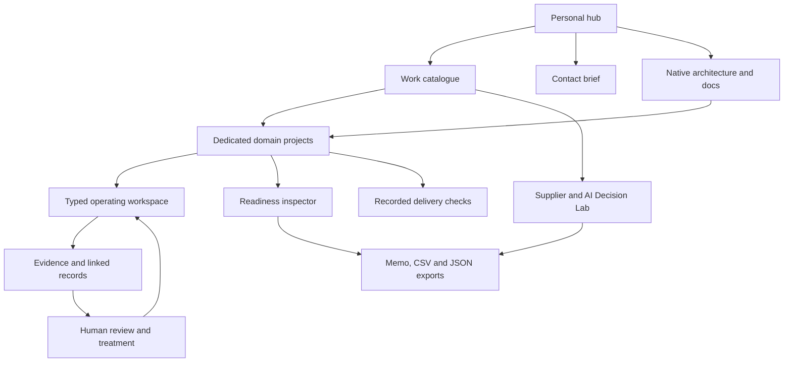
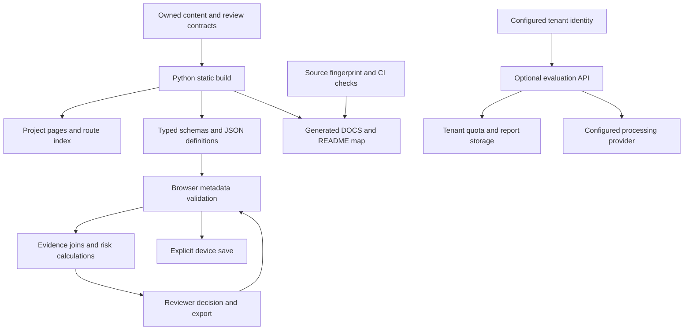

# Abdullah Al Owasi

**GRC & Technology Risk | AI Governance | Supplier Assurance & Audit Readiness**

I build connected governance workflows that make AI, supplier and audit decisions easier to inspect. Source records, evidence gaps, review gates and accountable next actions stay connected.

[Decision brief](https://aaowasi.pages.dev/contact/) · [Live governance workspace](https://aaowasi-projects.pages.dev/workspace/) · [Delivery evidence](https://aaowasi-projects.pages.dev/results/) · [Continuous GRC suite](https://aaowasi-projects.pages.dev/suite/)

## What you can inspect

- **29 connected domain projects** spanning AI governance, third-party risk, audit readiness, privacy, technology risk and assurance.
- **29 GRC operating domains**, **16 shared record types** and **132 register/reporting views** in the continuous GRC suite.
- Editable browser-local records, transparent scoring rules, evidence states, human review gates and exportable decision memos.
- Versioned source, validation workflows and recorded delivery checks tied to exact commits.

## Primary work

| Area | What the system demonstrates | Start here |
|---|---|---|
| AI governance | AI inventory, NIST AI RMF / Generative AI Profile mapping, evaluation evidence, human oversight, release and change review | [Open AI governance](https://aaowasi-projects.pages.dev/workspace/?module=ai-governance) |
| Third-party & AI vendor risk | SaaS / LLM intake, data handling, subprocessors, assurance evidence, dependency risk and treatment decisions | [Open vendor risk](https://aaowasi-projects.pages.dev/workspace/?module=vendor-risk) |
| Audit & continuous assurance | Evidence freshness, control-test state, exceptions, retest ownership and management outputs | [Open assurance](https://aaowasi-projects.pages.dev/workspace/?module=continuous-assurance) |

## Framework focus

NIST AI RMF 1.0 and NIST AI 600-1 · ISO/IEC 42001:2023 · ISO/IEC 27001:2022 · SOC 2 · NIST CSF 2.0 · GDPR processor governance · EU AI Act transparency

## Scoped services

**AI governance review sprint** — bounded AI inventory, oversight, evaluation evidence, release gates and change review.

**AI vendor & supplier assurance** — structured review of SaaS, LLM and external AI vendors with evidence requests, treatment decisions and remediation ownership.

**Continuous assurance review** — evidence expiry, exceptions, retest ownership and concise management reporting.

[Send a scope brief](https://aaowasi.pages.dev/contact/) if you have one defined AI use case, vendor set or assurance backlog to review.

> Public portfolio scenarios use synthetic data so methods, decision logic and guardrails can be inspected without exposing confidential records.

## Connected coverage

Regulatory obligations, policy governance, internal audit, corrective actions, cyber controls, resilience, KRIs, program oversight, privacy lifecycle and control effectiveness extend the specialist AI, supplier and assurance workflows. [Explore coverage](https://aaowasi.pages.dev/work/#coverage).

<!-- GENERATED-ARCHITECTURE:START -->

## Live architecture and route map

29 dedicated domain projects · 16 typed records · 132 register/reporting views.

[Complete operating and client guide](DOCS.md) · [Terms and conditions](TERMS_AND_CONDITIONS.md) · [License](LICENSE)

### Domain project hierarchy

- D01 **Corporate governance & accountability** → [project](https://aaowasi-projects.pages.dev/work/governance-program/) → [workspace](https://aaowasi-projects.pages.dev/workspace/?domain=governance-program)
- D02 **Enterprise risk & appetite** → [project](https://aaowasi-projects.pages.dev/work/executive-risk/) → [workspace](https://aaowasi-projects.pages.dev/workspace/?domain=executive-risk)
- D03 **Regulatory applicability & change** → [project](https://aaowasi-projects.pages.dev/work/regulatory-obligations/) → [workspace](https://aaowasi-projects.pages.dev/workspace/?domain=regulatory-obligations)
- D04 **Policy lifecycle** → [project](https://aaowasi-projects.pages.dev/work/policy-governance/) → [workspace](https://aaowasi-projects.pages.dev/workspace/?domain=policy-governance)
- D05 **Control implementation & ownership** → [project](https://aaowasi-projects.pages.dev/work/control-management/) → [workspace](https://aaowasi-projects.pages.dev/workspace/?domain=control-management)
- D06 **Internal audit & independence** → [project](https://aaowasi-projects.pages.dev/work/internal-audit/) → [workspace](https://aaowasi-projects.pages.dev/workspace/?domain=internal-audit)
- D07 **External audit & certification readiness** → [project](https://aaowasi-projects.pages.dev/work/audit-readiness/) → [workspace](https://aaowasi-projects.pages.dev/workspace/?domain=audit-readiness)
- D08 **Continuous assurance & remediation** → [project](https://aaowasi-projects.pages.dev/work/continuous-assurance/) → [workspace](https://aaowasi-projects.pages.dev/workspace/?domain=continuous-assurance)
- D09 **Supplier lifecycle & concentration** → [project](https://aaowasi-projects.pages.dev/work/vendor-risk/) → [workspace](https://aaowasi-projects.pages.dev/workspace/?domain=vendor-risk)
- D10 **Procurement & customer assurance** → [project](https://aaowasi-projects.pages.dev/work/customer-assurance/) → [workspace](https://aaowasi-projects.pages.dev/workspace/?domain=customer-assurance)
- D11 **Privacy & individual rights** → [project](https://aaowasi-projects.pages.dev/work/privacy-lifecycle/) → [workspace](https://aaowasi-projects.pages.dev/workspace/?domain=privacy-lifecycle)
- D12 **Processors & cross-border transfers** → [project](https://aaowasi-projects.pages.dev/work/processor-governance/) → [workspace](https://aaowasi-projects.pages.dev/workspace/?domain=processor-governance)
- D13 **Data classification & retention** → [project](https://aaowasi-projects.pages.dev/work/data-governance/) → [workspace](https://aaowasi-projects.pages.dev/workspace/?domain=data-governance)
- D14 **AI inventory & lifecycle authorization** → [project](https://aaowasi-projects.pages.dev/work/ai-governance/) → [workspace](https://aaowasi-projects.pages.dev/workspace/?domain=ai-governance)
- D15 **AI fairness, safety & oversight** → [project](https://aaowasi-projects.pages.dev/work/ai-safety/) → [workspace](https://aaowasi-projects.pages.dev/workspace/?domain=ai-safety)
- D16 **AI transparency & content provenance** → [project](https://aaowasi-projects.pages.dev/work/ai-transparency/) → [workspace](https://aaowasi-projects.pages.dev/workspace/?domain=ai-transparency)
- D17 **Shadow AI & acceptable use** → [project](https://aaowasi-projects.pages.dev/work/shadow-ai/) → [workspace](https://aaowasi-projects.pages.dev/workspace/?domain=shadow-ai)
- D18 **Continuity, recovery & crisis readiness** → [project](https://aaowasi-projects.pages.dev/work/resilience/) → [workspace](https://aaowasi-projects.pages.dev/workspace/?domain=resilience)
- D19 **Incident governance & reporting** → [project](https://aaowasi-projects.pages.dev/work/remediation/) → [workspace](https://aaowasi-projects.pages.dev/workspace/?domain=remediation)
- D20 **Workforce, physical & organizational security** → [project](https://aaowasi-projects.pages.dev/work/workforce-security/) → [workspace](https://aaowasi-projects.pages.dev/workspace/?domain=workforce-security)
- D21 **Financial, fraud & ethical conduct risk** → [project](https://aaowasi-projects.pages.dev/work/financial-conduct/) → [workspace](https://aaowasi-projects.pages.dev/workspace/?domain=financial-conduct)
- D22 **Sector, market & contractual obligations** → [project](https://aaowasi-projects.pages.dev/work/sector-assurance/) → [workspace](https://aaowasi-projects.pages.dev/workspace/?domain=sector-assurance)
- D23 **Security scope & authorization boundary** → [project](https://aaowasi-projects.pages.dev/work/security-boundary/) → [workspace](https://aaowasi-projects.pages.dev/workspace/?domain=security-boundary)
- D24 **Identity, least privilege & segregation** → [project](https://aaowasi-projects.pages.dev/work/identity-authorization/) → [workspace](https://aaowasi-projects.pages.dev/workspace/?domain=identity-authorization)
- D25 **Cloud configuration & change** → [project](https://aaowasi-projects.pages.dev/work/cloud-change/) → [workspace](https://aaowasi-projects.pages.dev/workspace/?domain=cloud-change)
- D26 **Threat, vulnerability & supply-chain assurance** → [project](https://aaowasi-projects.pages.dev/work/threat-supply-chain/) → [workspace](https://aaowasi-projects.pages.dev/workspace/?domain=threat-supply-chain)
- D27 **Logging, evidence integrity & provenance** → [project](https://aaowasi-projects.pages.dev/work/evidence-integrity/) → [workspace](https://aaowasi-projects.pages.dev/workspace/?domain=evidence-integrity)
- D28 **Agent, tool & data authorization** → [project](https://aaowasi-projects.pages.dev/work/agent-authorization/) → [workspace](https://aaowasi-projects.pages.dev/workspace/?domain=agent-authorization)
- D29 **Assessment, authorization & ongoing monitoring** → [project](https://aaowasi-projects.pages.dev/work/ongoing-authorization/) → [workspace](https://aaowasi-projects.pages.dev/workspace/?domain=ongoing-authorization)

<!-- GENERATED-ARCHITECTURE:END -->

## Enterprise implementation and advisory

The connected governance core is open source under AGPL-3.0. Paid scopes cover AI governance readiness, supplier assurance, control-to-evidence mapping, deployment, integration and scheduled support. [Review the enterprise delivery boundary](https://aaowasi-projects.pages.dev/enterprise/) or [request an implementation scope](https://aaowasi.pages.dev/contact/). Managed SaaS features require a contracted deployment; no active subscription is claimed.
